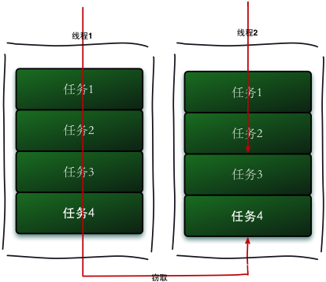

工作中，我们经常会用到线程池，通常是任务产生后放到一个任务队列，线程池中的线程不断从任务队列中取任务执行，但这样设计在一些情况下并不是最优的，更常见的实现是基于work-stealing的线程池。work-stealing从字面理解即工作窃取，工作窃取（work-stealing）算法是指某个线程从其他队列里窃取任务来执行。工作窃取的运行流程图如下： 

那么为什么需要使用工作窃取算法呢？假如我们需要做一个比较大的任务，我们可以把这个任务分割为若干互不依赖的子任务，为了减少线程间的竞争，于是把这些子任务分别放到不同的队列里，并为每个队列创建一个单独的线程来执行队列里的任务，线程和队列一一对应，比如A线程负责处理A队列里的任务。但是有的线程会先把自己队列里的任务干完，而其他线程对应的队列里还有任务等待处理。干完活的线程与其等着，不如去帮其他线程干活，于是它就去其他线程的队列里窃取一个任务来执行。而在这时它们会访问同一个队列，所以为了减少窃取任务线程和被窃取任务线程之间的竞争，通常会使用双端队列，被窃取任务线程永远从双端队列的头部拿任务执行，而窃取任务的线程永远从双端队列的尾部拿任务执行。

工作窃取算法的优点是充分利用线程进行并行计算，并减少了线程间的竞争，其缺点是在某些情况下还是存在竞争，比如双端队列里只有一个任务时。并且消耗了更多的系统资源，比如创建多个线程和多个双端队列。

即，基于work-strealing的线程池并不是在所有情况下都是最优的，应用它的最佳情景是线程池工作负荷比较重，外部客户大量提交任务到线程池中。而一般情况下，如果工作负荷不是很重或不是大量短任务这种情况也不一定要用线程池，所以，work-strealing算法还是很实用的。