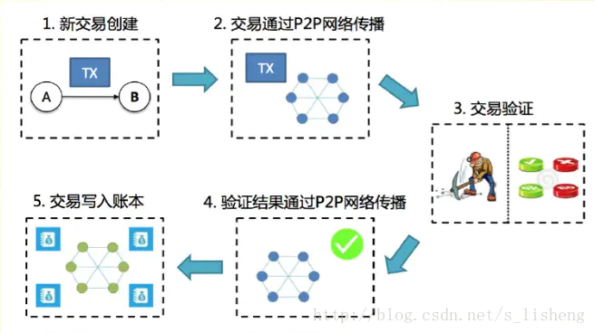

理解交易对比特币系统是如何工作的是非常重要的，可以说比特币整个的工作流程就是围绕着交易展开的。下面我们先叙述一下比特币交易流程，在宏观上对交易有个认识，后面会讲一下交易数据结构，具体在程序中是怎么定义的。下面先让我们看一下比特币交易流程。

### 比特币交易流程
比特币交易并不是通常意义上的一手交钱一手交货的交易，而是转账。如果每一笔转账都需要构造一笔交易数据会比较笨拙，为了使得价值易于组合与分割，比特币的交易被设计为可以纳入多个输入和输出，即一笔交易可以转账给多个人。从生成到在网络中传播，再到通过工作量证明、整个网络节点验证，最终记录到区块链，就是区块链交易的整个生命周期。整个区块链交易流程如下图所示：


1. 交易的生成——构造一笔交易，设置交易的输入输出，并签名确认。
2. 交易的传播——A将交易广播至全网，节点收到交易验证通过后再广播给其他节点，并都将收到的交易纳入一个区块中等待工作量证明。*（对B而言，该笔比特币会即时显示在比特币钱包中，但直到区块确认成功后才可用。目前一笔比特币从支付到最终确认成功，一般要经过6个区块确认之后才能真正确认到账）*
3. 工作量证明——每个节点通过相当于解一道数学题的工作量证明机制，从而获得创建新区块的权力，并争取得到数字货币的奖励，交易上链。*（新比特币在此过程中产生）*
4. 整个网络节点验证——当一个节点找到解时，它就向全网广播该区块，并由全网其他节点验证。如果验证通过则向其他节点广播并进行第5步。
5. 记录到区块链——上一步验证通过后，将新区块加入到最长的区块链中。之后继续竞争下一个区块，这样就形成了一个合法记账的区块链。*（每个区块的创建时间大约在10分钟。随着全网算力的不断变化，每个区块的产生时间会随算力增强而缩短、随算力减弱而延长。其原理是根据最近产生的2016个区块的时间差，自动调整每个区块的生成难度，使得每个区块的生成时间是10分钟）*

>比特币难度调整公式(新难度计算公式)： $New \ Difficulty=Old \ Difficulty \times (Actual \ Time\  of\ Last\ 2016\ Blocks/20160 \ minutes)$.

到这里，你已经理解了一笔交易从创建到写入区块链的整个流程，下面我们讨论一下其中的细节。先看一下交易的数据结构。

### 比特币交易数据结构
一笔比特币交易是一个含有输入和输出的数据结构，直白点就是要说明清楚这边交易的钱从哪里来，钱到哪里去。我们看一下在源码中交易的字段有那些，主要字段：
 - 输入列表`vin`
 - 输出列表`vout`
 - 协议版本`nVersion`
 - 锁定时间`nLockTime`

```c++
/** The basic transaction that is broadcasted on the network and contained in
 * blocks.  A transaction can contain multiple inputs and outputs.  */
class CTransaction {
public:
    // Default transaction version.
    static const int32_t CURRENT_VERSION=2;

    // Changing the default transaction version requires a two step process: first
    // adapting relay policy by bumping MAX_STANDARD_VERSION, and then later date
    // bumping the default CURRENT_VERSION at which point both CURRENT_VERSION and
    // MAX_STANDARD_VERSION will be equal.
    static const int32_t MAX_STANDARD_VERSION=2;

    // The local variables are made const to prevent unintended modification
    // without updating the cached hash value. However, CTransaction is not
    // actually immutable; deserialization and assignment are implemented,
    // and bypass the constness. This is safe, as they update the entire
    // structure, including the hash.
    const std::vector<CTxIn> vin;
    const std::vector<CTxOut> vout;
    const int32_t nVersion;
    const uint32_t nLockTime;

private:
    /** Memory only. */
    const uint256 hash;
    const uint256 m_witness_hash;

    uint256 ComputeHash() const;
    uint256 ComputeWitnessHash() const;

public:
// ...... 下面代码这里省略掉了......
    
};
```

这里先解释一下`nLockTime`字段，后面如果学习闪电网络的话会用到这个字段。
```c++
// Threshold for nLockTime: below this value it is interpreted as block number, otherwise as UNIX timestamp.
static const unsigned int LOCKTIME_THRESHOLD = 500000000;
```
>锁定时间定义了能被加到区块链里最早的交易时间。在大多数交易里，它被设置成0，表示立即执行。如果锁定时间大于0且小于5亿，就被视为区块高度，在此区块高度之前，该交易不能被包含在区块链里。如果锁定时间大于5亿，则被当做一个UNIX时间戳（1970年1月1日以来的秒数），在这个时间点之前，该交易不能被包含在区块链里。

协议版本`nVersion`很好理解，就是明确这笔交易参照的规则协议。

最重要的是交易输入和输出，在分析交易输入和输出之前我们先使用BitcoinCore的命令行界面（`getrawtransaction`和`decodeawtransaction`）来检索一笔“原始”交易，对其进行解码，并查看它包含的内容。 交易被解码后是这个样子，结果如下：
>你也可以通过[区块链浏览器](https://btc.com)查看这笔交易（块高度： 277316 ， 交易ID ：0627052b6f28912f2703066a912ea577f2ce4da4caa5a5fbd8a57286c345c2f2）
```
{
  "version": 1,
  "locktime": 0,
  "vin": [
    {
      "txid":"7957a35fe64f80d234d76d83a2a8f1a0d8149a41d81de548f0a65a8a999f6f18",      // 交易ID
      "vout": 0,        // 输出索引（vout），用于标识来自该交易的哪个UTXO被引用（第一个为零）
      "scriptSig": "3045022100884d142d86652a3f47ba4746ec719bbfbd040a570b1deccbb6498c75c4ae24cb02204b9f039ff08df09cbe9f6addac960298cad530a863ea8f53982c09db8f6e3813[ALL] 0484ecc0d46f1918b30928fa0e4ed99f16a0fb4fde0735e7ade8416ab9fe423cc5412336376789d172787ec3457eee41c04f4938de5cc17b4a10fa336a8d752adf",  // 解锁脚本，满足放置在UTXO上的条件，解锁它用于支出
      "sequence": 4294967295    // 序列号
    }
 ],
  "vout": [
    {
      "value": 0.01500000,
      "scriptPubKey": "OP_DUP OP_HASH160 ab68025513c3dbd2f7b92a94e0581f5d50f654e7 OP_EQUALVERIFY OP_CHECKSIG"
    },
    {
      "value": 0.08450000,
      "scriptPubKey": "OP_DUP OP_HASH160 7f9b1a7fb68d60c536c2fd8aeaa53a8f3cc025a8 OP_EQUALVERIFY OP_CHECKSIG",
    }
  ]
}
```
到这里，你对交易应该有了一个感性的认识了，这笔交易有1个输入，2个输出。下面我们接着看交易输入输出。
#### 交易输入 
```c++
/** An input of a transaction.  It contains the location of the previous
 * transaction's output that it claims and a signature that matches the
 * output's public key. */
class CTxIn
{
public:
    COutPoint prevout;      // 指向输入中引用的UTXO
    CScript scriptSig;      // 解锁脚本，首先检索引用的UTXO，检查其锁定脚本，然后使用它来构建所需的解锁脚本以满足此要求。
    uint32_t nSequence;     // 序列号
    CScriptWitness scriptWitness; //!< Only serialized through CTransaction    ，见证脚本

//.......省略下面部分代码.............
};

/** An outpoint - a combination of a transaction hash and an index n into its vout */
class COutPoint
{
public:
    uint256 hash;   // 交易ID
    uint32_t n;     // 输出索引，表明是交易中的第几个输出

// ......省略下面部分代码......
};
```
可以看到，交易输入就是上一笔交易的输出，需要构建解锁脚本以证明你对该笔输出的所有权，然后你可以花费这笔输出。

#### 交易输出
```c++
/** An output of a transaction.  It contains the public key that the next input
 * must be able to sign with to claim it.
 */
class CTxOut
{
public:
    CAmount nValue;             // 输出金额
    CScript scriptPubKey;       // 锁定脚本（脚本公钥） ，对于一个比特币交易来说，交易本身是不用关心输出的地址，交易只需要关心锁定脚本，当使用的时候能使用正确的解锁脚本即可动用比特币。

// ......省略下面部分代码......
};
```
输出更简单，就是指定转账金额，输出给谁，构建一个锁定脚本，只有转账接收者才能解锁成功。拥有该输出金额的所有权。


### 交易费
可以看到，交易的数据结构没有交易费的字段。相替代地，交易费是指输入和输出之间的差值。从所有输入中扣掉所有输出之后的多余的量会被矿工作为交易费收集走：
```
交易费即输入总和减输出总和的余量：交易费 = 求和（所有输入） - 求和（所有输出）
```

交易费，最直接的影响是与交易被处理的优先级有关，交易费用高的交易会被矿工优先打包处理，会在较短的时间经过验证上链，而交易费用低的交易则会最后处理。同时，交易费用的设置，使得在比特币网络上发交易是有成本的，避免了大量可能的无用交易。

### 查询交易
可通过区块链浏览器查询每一笔比特币交易，比特币区块链浏览器有很多，这里使用 https://btc.com 进行查询。


### 比特币交易脚本和脚本语言

脚本是区块链上实现自动验证、自动执行合约的重要技术。脚本类似一套规则，它约束着接收方怎样才能花掉这个输出上锁定的资产。交易和合法性验证也依赖于脚本。我们看一下比特币交易中的锁定脚本和解锁脚本。

#### 锁定脚本和解锁脚本

锁定脚本是在输出交易上加上的条件，通过一段脚本语言来实现，位于交易的输出。解锁脚本只有满足锁定脚本要求的条件，才能花掉这个脚本上对应的资产，位于交易的输入。解释脚本是通过类似编程领域里的“虚拟机”，它分布式运行在区块链网络里的每一个节点。

每一个比特币验证节点会通过同时执行锁定和解锁脚本来验证一笔交易。每个输入都包含一个解锁脚本，并引用了之前存在的UTXO。 验证软件将复制解锁脚本，检索输入所引用的UTXO，并从该UTXO复制锁定脚本。然后依次执行解锁和锁定脚本。如果解锁脚本满足锁定脚本条件，则输入有效。所有输入都是独立验证的，作为交易总体验证的一部分。

下图是最常见类型的比特币交易（P2PKH:对公钥哈希的付款）的解锁和锁定脚本的示例，显示了在脚本验证之前从解锁和锁定脚本的并置产生的组合脚本：


比特币的脚本语言被称为基于堆栈的语言，因为它使用一种被称为堆栈的数据结构。脚本语言通过从左到右处理每个项目来执行脚本。数字（数据常量）被推到堆栈上。操作码（Operators）从堆栈中推送或弹出一个或多个参数，对其进行操作，并可能将结果推送到堆栈上。

#### 解锁和锁定脚本的单独执行
在最初版本的比特币客户端中，解锁和锁定脚本是以连锁的形式存在，并被依次执行的。出于安全因素考虑，比特币开发者们修改了这个特性——因为存在“允许异常解锁脚本推送数据入栈并且污染锁定脚本”的漏洞。而在当前的方案中，这两个脚本是随着堆栈的传递被分别执行的。

首先，使用堆栈执行引擎执行解锁脚本。如果解锁脚本在执行过程中未报错（例如：没有“悬挂”操作码），则复制主堆栈（而不是备用堆栈），并执行锁定脚本。如果从解锁脚本中复制而来的堆栈数据执行锁定脚本的结果为“TRUE"，那么解锁脚本就成功地满足了锁定脚本所设置的条件，因此，该输入是一个能使用该UTXO的有效授权。如果在合并脚本后的结果不是”TRUE“以外的任何结果，输入都是无效的，因为它不能满足UTXO中所设置的使用该笔资金的条件。

下面以最常见类型的比特币交易（P2PKH:对公钥哈希的付款）的解锁和锁定脚本为例（见上图），说明执行过程。


### Coinbase交易
上面讲的都是普通情况下的交易，但有一个例外，即存在一种被称为“币基交易”（Coinbase Transaction）的特殊交易，它是每个区块中的第一笔交易，这种交易存在的原因是作为对挖矿的奖励，创造出全新的可花费比特币用来支付给“赢家”矿工。

### 引申思考
为什么比特币交易要设计成这种输入输出的结构，与以太坊等区块链的结构是不同的。我的理解，是要回到比特币设计的初衷，比特币是一个非中心化的点对点电子支付系统，非中心化实现这一系统，最大的问题在于如何解决双花问题。当然，如何解决双花问题不是仅仅设计一个交易数据结构就可以解决的，还需要结合Pow共识算法及整个比特币区块链实现流程。设计成这种数据结构，一个最大的好处是每笔交易的比特币都是可追溯的，你甚至一直可以追溯到它的诞生，挖矿奖励。因为每一笔交易（花费的比特币）都是可追溯的，作弊者就无法构造一个无中生有的比特币，它无法构造出合法的未花费交易输出。每一笔交易都会通过广播尽力广播给所有比特币节点。