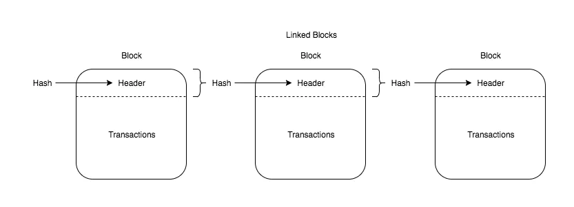
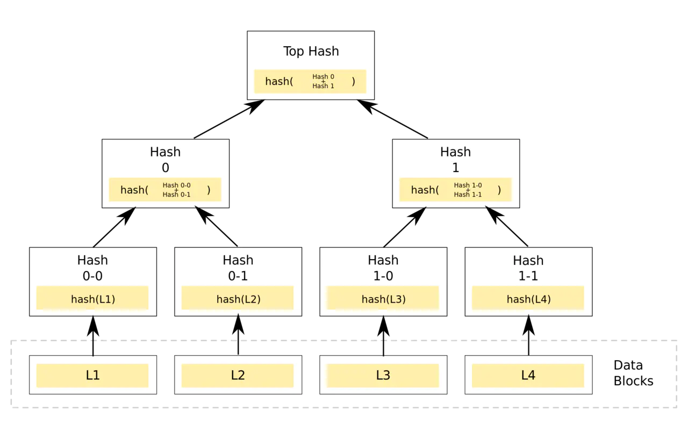
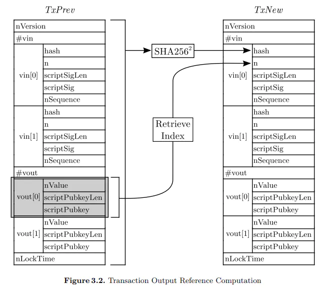

我们学习计算机时曾经有这么一个定义：`程序=数据结构+算法`，对于一个区块链，我认为从技术方面看与程序的定义类似，核心一个是共识算法，一个是核心数据结构，这两点直接决定了这条区块链工作运行原理。比特币的共识算法，在这一篇[《哈希函数与比特币共识算法PoW》](https://mp.weixin.qq.com/s/HscR67wINttG4OfP0NkYdg)中已经讲述了其原理，这一篇主要讲述比特币核心数据结构这一部分。主要包括如下内容：
- Blockchain（区块链）
- Block（区块）
- Block Header（区块头部）
- Merkle Tree（默克尔树）
- Transaction（交易）

#### Blockchain
 区块链很难用一个什么定义来描述，如果一定要描述的话，借用以太坊黄皮书中的解释：<u>区块链就是一个具有共享状态的密码性安全交易的单机(cryptographically secure transactional singleton machine with shared-state)。</u>这里按数据结构的层面来描述区块链，就是用哈希指针将一些列区块串联起来形成的一条数据链。在比特币区块链中，是有区块这个概念的，现在部分区块链中已经没有区块这个概念了，感兴趣的可以关注一下DAG。
 
#### Block
上面讲到区块链是由一个个区块构成的，哪区块是怎么定义的？由区块头部和交易两部分构成：
- 区块头部: a data structure containing the block's metadata
- 交易列表: an array (vector in rust) of transactions


C++版本实现定义：
```c++
class CBlock : public CBlockHeader {
public:
    // network and disk
    std::vector<CTransactionRef> vtx;
    //...省略部分代码...
}
```
Rust版本实现定义，可以看到基本都是一样的：
```rust
#[derive(Debug, PartialEq, Clone, Serializable, Deserializable)]
pub struct Block {
	pub block_header: BlockHeader,          // 区块头部
	pub transactions: Vec<Transaction>,     // 交易列表
}
```

#### BlockHeader
区块头部定义如下：

c++版本实现定义：
```c++
/** Nodes collect new transactions into a block, hash them into a hash tree,
 * and scan through nonce values to make the block's hash satisfy proof-of-work
 * requirements.  When they solve the proof-of-work, they broadcast the block
 * to everyone and the block is added to the block chain.  The first transaction
 * in the block is a special one that creates a new coin owned by the creator
 * of the block.
 */
class CBlockHeader {
public:
    // header
    int32_t nVersion;       // 版本号，指定验证规则(indicates which set of block validation rules to follow) 
    uint256 hashPrevBlock;  // 前一区块哈希（实际计算时取得是前一区块头哈希）(a reference to the parent/previous block in the blockchain)
    uint256 hashMerkleRoot; // 默克尔根哈希(a hash (root hash) of the merkle tree data structure containing a block's transactions)
    uint32_t nTime;         // 时戳(seconds from Unix Epoch)
    uint32_t nBits;         // 区块难度(aka the difficulty target for this block)
    uint32_t nNonce;        // 工作量证明nonce(value used in proof-of-work)

    // ...部分代码省略...
}
```
Rust实现版本定义，可以看到基本都是一样的：
```rust
#[derive(PartialEq, Clone, Serializable, Deserializable)]
pub struct BlockHeader {
	pub version: u32,                   // 版本号，指定验证规则
	pub previous_header_hash: H256,     // 前一区块哈希
	pub merkle_root_hash: H256,         // 默克尔根哈希
	pub time: u32,                      // 时戳
	pub bits: Compact,                  // 区块难度
	pub nonce: u32,                     // 工作量证明nonce
}
```

#### Merkle Tree
上面区块头部的`hashMerkleRoot`字段就是默克尔树根哈希值，默克尔树可以说是区块中最重要的一个数据结构，不仅仅提供了整个区块所有交易的完整性验证，。


Rust版本Merkle tree代码实现如下：
```rust
/// Calculates the root of the merkle tree
/// https://en.bitcoin.it/wiki/Protocol_documentation#Merkle_Trees
pub fn merkle_root<T: AsRef<H256> + Sync>(hashes: &[T]) -> H256{
	// 递归结束条件
	if hashes.len() == 1 {
		return hashes[0].as_ref().clone();
	}
	// 哈希成对，为下一步计算做准备
	let mut row = Vec::with_capacity(hashes.len() / 2);
	let mut i = 0;
	while i + 1 < hashes.len() {
		row.push((&hashes[i], &hashes[i + 1]));
		i += 2
	}

	// duplicate the last element if len is not even
	if hashes.len() % 2 == 1 {
		let last = &hashes[hashes.len() - 1];
		row.push((last, last));     //如果元素是奇数个数，将最后一个元素复制一份，自己与自己配对
	}
	
	// 一层一层的递归计算，一直到只有最后一个根哈希值
	let res: Vec<_>;
	// Only compute in parallel if there is enough work to benefit it
	if row.len() > 250 {
		res = row.par_iter().map(|x| merkle_node_hash(&x.0, &x.1)).collect();
	} else {
		res = row.iter().map(|x| merkle_node_hash(&x.0, &x.1)).collect();
	}
	merkle_root(&res)       
	// 这里不用担心递归的深度，其一，比特币区块大小有限，限制了交易数量；其二，是因为Merkle tree是类似二叉树的结构，递归计算次数为log(n)，即使n非常大，递归次数也很小。
}

/// Calculate merkle tree node hash
pub fn merkle_node_hash<T>(left: T, right: T) -> H256 where T: AsRef<H256> {
	dhash256(&*concat(left, right))     //双SHA-256哈希运算
}

#[inline]
fn concat<T>(a: T, b: T) -> H512 where T: AsRef<H256> { //将2个哈希值并在一起
	let mut result = H512::default();
	result[0..32].copy_from_slice(&**a.as_ref());
	result[32..64].copy_from_slice(&**b.as_ref());
	result
}
```

#### Transaction
Rust实现版本定义如下：
```rust
pub struct Transaction {
	pub version: i32,                       //协议版本，明确这笔交易参照的规则协议
	pub inputs: Vec<TransactionInput>,      //输入列表
	pub outputs: Vec<TransactionOutput>,    //输出列表
	pub lock_time: u32,                     //锁定时间
}
```
可以看到，交易中最重要的是输入列表和输出列表，说明这次比特币转账时比特币的来源和转账去向。

Rust版本实现输入列表定义：
```rust
pub struct TransactionInput {
	pub previous_output: OutPoint,      //上一笔交易输出
	pub script_sig: Bytes,              //解锁脚本
	pub sequence: u32,                  //序列号
	pub script_witness: Vec<Bytes>,     //见证脚本
}

/** An outpoint - a combination of a transaction hash and an index n into its vout */
pub struct OutPoint {
	pub hash: H256,     //交易ID
	pub index: u32,     //输出索引，表明是交易中的第几个输出
}
```
上面这个`OutPoint`定义如何没有理解的话，可参考下图进行理解：



Rust版本实现输出列表定义：
```rust
pub struct TransactionOutput {
	pub value: u64,             //输出金额
	pub script_pubkey: Bytes,   //锁定脚本，对于一个比特币交易来说，交易本身是不用关心输出的地址，交易只需要关心锁定脚本，当使用的时候能使用正确的解锁脚本即可动用比特币。
}
```