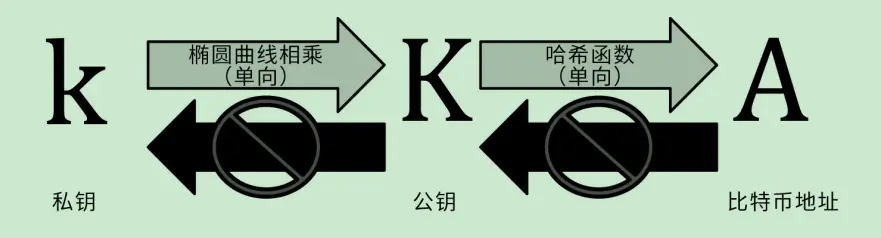

对于比特币用户来讲，与它们最直接相关的就是比特币中私钥、账户及钱包了，这里讲述一下这三个概念及相关细节。在这之前，先简单的叙述一下相关的公钥密码学知识。

### 公钥密码体制(Public-key cryptography)
公钥密码体制分为三部分：公钥、私钥、加密解密算法。公钥密码体制的公钥和算法都是公开的(这也是公钥密码体制名称的来源)，私钥是保密的。针对不同的用途，可选择采用公钥还是私钥进行加密，再用对应的私钥或者公钥进行解密。公钥密码体制主要功能有以下三点：
- 加解密功能
- 签名验证功能
- 密钥协商功能

在⽐特币系统中，我们⽤公钥加密创建⼀个密钥对，⽤于控制⽐特币的获取。密钥对包括⼀个私钥，和由其衍⽣出的唯⼀的公钥。公钥⽤于接收⽐特币，⽽私钥⽤于⽐特币⽀付时的交易签名。公钥和私钥之间的数学关系，使得私钥可⽤于⽣成特定消息的签名。此签名可以在不泄露私钥的同时对公钥进⾏验证。⽀付⽐特币时，⽐特币的当前所有者需要在交易中提交其公钥和签名（每次交易的签名都不同，但均从同⼀个私钥⽣成）。⽐特币⽹络中的所有⼈都可以通过所提交的公钥和签名进⾏验证，并确认该交易是否有效，即确认⽀付者在该时刻对所交易的⽐特币拥有所有权。

### 私钥
私钥其实就是一个随机选出的数字而已。一个比特币地址中的所有资金的控制取决于相应私钥的所有权和控制权。在比特币交易中，私钥用于生成支付比特币所必需的签名以证明对资金的所有权。私钥必须始终保持机密，因为一旦被泄露给第三 方，相当于该私钥保护之下的比特币也拱手相让了。私钥还必须进行备份，以防意外丢失，因为私钥一旦丢失就难以复原，其所保护的比特币也将永远丢失。

这个随机数字怎么选出来的呢？一般是通过随机函数生成器来实现的，这里不再细述。

### 比特币账户
上图中，我们已经看到比特币账户（地址）的大致生成过程（私钥-->公钥-->比特币地址），这里详细的描述其生成细节。在比特币账户生成过程中应用了两个密码学哈希函数，一个是SHA256，另一个是RIPEMD160。下图为比特币地址（账户）的生成流程：

1. 通过随机数发生器生成一个256bit的随机数，并使用该随机数作为账户的私钥。
2. 比特币采用椭圆曲线签名算法（ECDSA）来对数据进行签名和验证，具体使用的是secp256k1曲线。通过ECC乘法可以计算出对应的公钥。
3. 对公钥进行两次哈希运算，得到公钥的哈希值。
4. 对`<比特币地址前缀0x00 | 公钥哈希值>`做双哈希运算，取前4字节作为校验码。 
5. 对`<比特币地址前缀0x00 | 公钥哈希 | 校验码>`进行base58编码得到地址。

其他前缀的含义如下表：
|种类| 版本前缀(hex) |Base58格式|
|--|--|--|
Bitcoin Address| 0x00 |1
Pay-to-Script-Hash Address |0x05| 3
Bitcoin Testnet Address |0x6F| m or n
Private Key WIF（钱包导入格式） |0x80| 5（没有压缩）, K or L （压缩格式）
BIP38 Encrypted Private Key| 0x0142| 6P
BIP32 Extended Public Key| 0x0488B21E| xpub

采用base58编码格式对地址进行编码，主要是为了方便使用和识别。

### 比特币钱包
钱包是一个应用程序，为用户提供交互界面。钱包控制用户访问权限，管理密钥和地址，跟踪余额以及创建和签名交易。其中，最核心的功能是保管私钥，一旦私钥泄露或者忘了，就会造成比特币被盗走或丢失。

钱包里有比特币吗？钱包里只有密钥，并没有比特币。

那我的比特币在哪里？你拥有的比特币实际上是所有你账户地址的未花费交易输出。钱包会监控到输出到你的公钥地址的输出，比如A转给你1个比特币，B转给你9个比特币，而你目前没有将它们转给其他人，则钱包计算出目前你有10个比特币。当你需要花费比特币转账给其他人时，你构造一笔交易，用你的未花费交易输出作为输入，输出为接收方账户地址，并设置转账金额，自己的公钥信息等，对再交易签名（私钥签名）确认后，发送到比特币网络等待确认后，转账完成。
