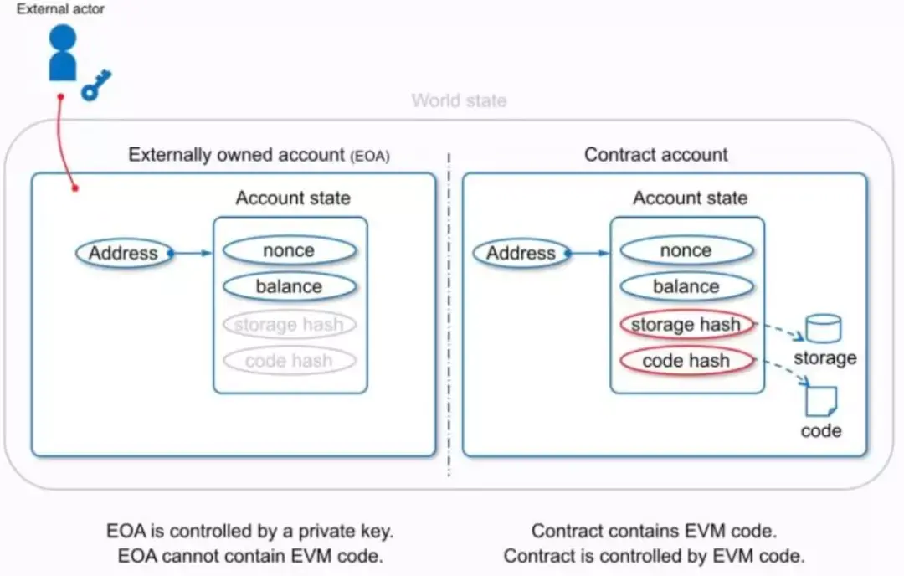
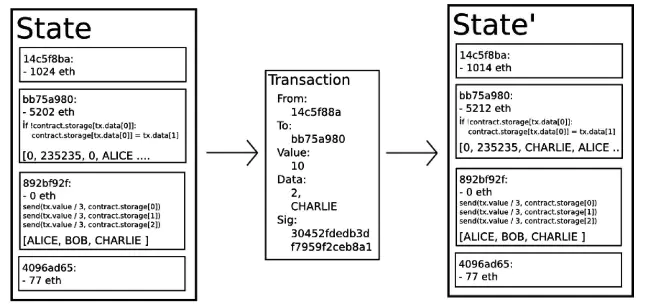

区块链就是一个具有共享状态的密码性安全交易的单机。以太坊作为比特币后非常有影响力的公有链，其本质就是一个基于交易的状态机。**与其他分布式系统不同的是，它的目的就是要所有的节点拥有相同的状态。**

### 一、以太坊主要特点
<font color=CadetBlue>以太坊（Ethereum）目标是打造成一个运行智能合约的去中心化平台</font>，平台上的应用按程序设定运行，不存在停机、审查、欺诈、第三方人为干预的可能。为了打造这个平台，以太坊提供了一条公开的区块链，并制定了面向智能合约的一套编程语言Solidity。智能合约开发者可以在其上使用官方提供的工具来开发支持以太坊区块链协议的应用。以太坊的特点主要包括：

- 单独为智能合约指定编程语言Solidity；
- 使用了内存需求较高的哈希函数：避免出现算力矿机；
- uncle 块激励机制：降低矿池的优势，减少区块产生间隔为 15 秒；
- 难度调整算法：一定的自动反馈机制；
- gas 限制调整算法：限制代码执行指令数，避免循环攻击；
- 记录当前状态的哈希树的根哈希值到区块：某些情形下实现轻量级客户端；
- <font color=CadetBlue>为执行智能合约而设计的简化的虚拟机 EVM。</font> (可以说这是以太坊的最大贡献)

### 二、以太坊核心概念
区别于比特币的UTXO，以太坊是基于账户的。其细节与比特币有很大的不同。

#### 账户
以太坊中有两类账户，它们共用同一个地址空间。
- 外部账户，该类账户被公钥-私钥对控制。
- 合约账户，该类账户被存储在账户中的代码控制。


外部账户的地址是由公钥决定的，合约账户的地址是在创建合约时由合约创建者的地址和该地址发出过的交易数量计算得到。两类账户的唯一区别是：外部账户没有代码，人们可以通过创建和签名一笔交易从一个外部账户发送消息。每当合约账户收到一条消息，合约内部的代码就会被激活，允许它对内部存储进行读取、写入、发送其他消息和创建合约。

以太坊的账户包含4个部分：       
①随机数，用于确定每笔交易只能被处理一次的计数器；       
②账户目前的以太币余额；     
③账户的合约代码（如果有的话）；     
④账户的存储（默认为空）。   
```rust
/// Basic account type.
#[derive(Debug, Clone, PartialEq, Eq)]
pub struct BasicAccount {
	/// Nonce of the account.
	pub nonce: U256,
	/// Balance of the account.
	pub balance: U256,
	/// Storage root of the account.
	pub storage_root: H256,
	/// Code hash of the account.
	pub code_hash: H256,
	/// Code version of the account.
	pub code_version: U256,
}
```
#### 消息
以太坊的消息在某种程度上类似于比特币的交易，但是两者之间存在3点重要的不同：     
1）以太坊的消息可以由外部实体或者合约创建，然而比特币的交易只能从外部创建。     
2）以太坊消息可以选择包含数据。     
3）如果以太坊消息的接收者是合约账户，可以选择进行回应，这意味着以太坊消息也包含函数概念。

#### 交易
<font color=CadetBlue>以太坊中“交易”是指存储从外部账户发出的消息的签名数据包。</font>交易包含消息的接收者、用于确认发送者的签名、以太币账户余额、要发送的数据和被称为STARTGAS和GASPRICE的两个数值。为了防止代码出现指数型爆炸和无限循环，每笔交易需要对执行代码所引发的计算步骤做出限制。STARTGAS就是通过需要支付的燃料来对计算步骤进行限制，GASPRICE是每一计算步骤需要支付矿工的燃料的价格。
```rust
/// Signed transaction information without verified signature.
#[derive(Debug, Clone, Eq, PartialEq, MallocSizeOf)]
pub struct UnverifiedTransaction {
	/// Plain Transaction.
	unsigned: Transaction,
	/// The V field of the signature; the LS bit described which half of the curve our point falls
	/// in. The MS bits describe which chain this transaction is for. If 27/28, its for all chains.
	v: u64,
	/// The R field of the signature; helps describe the point on the curve.
	r: U256,
	/// The S field of the signature; helps describe the point on the curve.
	s: U256,
	/// Hash of the transaction
	hash: H256,
}

/// A set of information describing an externally-originating message call
/// or contract creation operation.
#[derive(Default, Debug, Clone, PartialEq, Eq, MallocSizeOf)]
pub struct Transaction {
	/// Nonce.
	pub nonce: U256,
	/// Gas price.
	pub gas_price: U256,
	/// Gas paid up front for transaction execution.
	pub gas: U256,
	/// Action, can be either call or contract create.
	pub action: Action,
	/// Transfered value.
	pub value: U256,
	/// Transaction data.
	pub data: Bytes,
}
```
#### Gas
以太坊上的每笔交易都会被收取一定数量的燃料Gas，设置Gas的目的是限制交易执行所需的工作量，同时为交易的执行支付费用。当EVM执行交易时，Gas将按照特定规则被逐渐消耗。Gas价格由交易创建者设置，发送账户需要预付的交易费用= GASPRICE * Gas amount。如果执行结束还有Gas剩余，这些Gas将被返还给发送账户。无论执行到什么位置，一旦Gas被耗尽就会触发一个out-of-gas异常。同时，当前调用帧所做的所有状态修改都将被回滚。

#### 以太坊虚拟机
<font color=CadetBlue>以太坊虚拟机(EVM)是智能合约的运行环境。</font>它是一个完全独立的沙盒，合约代码在EVM内部运行，对外是完全隔离的，甚至不同合约之间也只有有限的访问权限。它是以太坊项目中的一个主要创新。

##### 存储、主存和栈
每个账户都有一块永久的内存区域，被称为存储，其形式为key-value，key和value的长度均为256位。在合约里，不能遍历账户的存储。相对于主存和栈，存储的读操作开销较大，修改存储甚至更多。一个合约只能对它自己的存储进行读写。

第二个内存区被称为主存。合约执行每次消息调用时都有一块新的被清除过的主存。主存可以按字节寻址，但是读写的最小单位为32字节。操作主存的开销随着主存的增长而变大。

EVM不是基于寄存器的，而是基于栈的虚拟机。因此所有的计算都在一个称为栈的区域内执行。栈最大有1024个元素，每个元素有256位。对栈的访问只限于其顶端，允许复制最顶端的16个元素中的一个到栈顶，或者是交换栈顶元素和下面16个元素中的一个。所有其他操作都只能取最顶的一个或几个元素，并把结果压在栈顶。当然可以把栈里的元素放到存储或者主存中。但是无法只访问栈里指定深度的那个元素，在那之前必须把指定深度之上的所有元素都从栈中移除才行。

##### 指令集
EVM的指令集被刻意保持在最小规模，以尽可能避免可能导致共识问题的错误。所有的指令都是针对256位这个基本的数据单位进行的操作，具备常用的算术、位、逻辑和比较操作，也可以进行条件和无条件跳转。此外，合约可以访问当前区块的相关属性，比如它的编号和时间戳。

##### 消息调用
合约可以通过消息调用的方式来调用其他合约，或者发送以太币到非合约账户。消息调用和交易非常类似，它们都有一个源，一个目标，数据负载，以太币，Gas和返回数据。事实上每个交易都可以被认为是一个顶层消息调用，这个消息调用会依次产生更多的消息调用。

一个合约可以决定剩余Gas的分配。比如内部消息调用时使用多少Gas，或者期望保留多少Gas。如果在内部消息调用时发生了out-of-gas异常或者其他异常，合约将会得到通知，一个错误码被压入栈中。这种情况只是内部消息调用的Gas耗尽。在solidity中，这种情况下发起调用的合约默认会触发一个人工异常，这个异常会打印出调用栈。

就像之前说过的，被调用的合约（发起调用的合约也一样）会拥有崭新的主存，并能够访问调用的负载。调用负载被存储在一个单独的被称为calldata的区域。调用执行结束后，返回数据将被存放在调用方预先分配好的一块内存中。调用层数被限制为1024。因此对于更加复杂的操作，我们应该使用循环而不是递归。

#### 代码调用和库
以太坊中存在一种特殊类型的消息调用，被称为callcode。它跟消息调用几乎完全一样，只是加载来自目标地址的代码将在发起调用的合约上下文中运行。这意味着一个合约可以在运行时从另外一个地址动态加载代码。存储，当前地址和余额都指向发起调用的合约，只有代码是从被调用地址获取的。这使得Solidity可以实现“库”。可复用的库代码可以应用在一个合约的存储上，可以用来实现复杂的数据结构，从而使智能合约更加的强大。

#### 以太坊的状态转换
以太坊的状态转换是指在一个交易发生时，以太坊从一个正确状态$S$转变到下一个正确状态$S'$的转换过程。


状态转换函数$APPLY(S,TX)->S'$的具体过程：
1. 检查交易的格式是否正确，签名是否有效，以及随机数是否与发送者账户的随机数匹配。如否，返回错误。
2. 计算交易费用$fee=STARTGAS*GASPRICE$，并从签名中确定发送者的地址。从发送者的账户中减去交易费用和增加发送者的随机数。如果账户余额不足，返回错误。
3. 设定初值$Gas=STARTGAS$，并根据交易中的字节数减去一定量的燃料值。
4. 从发送者的账户转移价值到接收者的账户。如接收账户不存在，创建此账户。如果接收账户是一个合约，运行合约的代码，直到代码运行结束或者燃料用完。
5. 如果因为发送者账户没有足够的费用或者代码执行耗尽燃料导致价值转移失败，恢复原来的状态，但是还需要支付交易费用，交易费用加至矿工账户。
6. 若代码执行成功，将所有剩余的燃料归还给发送者，消耗掉的燃料作为交易费用发送给矿工。


### 三、以太坊智能合约
#### 智能合约
区块链可以为智能合约提供可信的执行环境，以太坊实现了区块链和智能合约的完整契合。以太坊是内置有图灵完备编程语言的区块链，通过建立抽象的基础层，使得任何人都能够创建合约和去中心化应用，并在其中设立他们自由定义的所有权规则、交易方式和状态转换函数。

#### 开发语言
以太坊有4种专用语言：
- Serpent(受python启发)
- Solidity(受JavaScript启发)
- Mutan(受Go启发)
- LLL(受Lisp启发)

#### 代码执行
以太坊合约的代码是使用低级的基于堆栈的字节码的语言写成的，被称为“以太坊虚拟机代码”（“EVM代码”）。