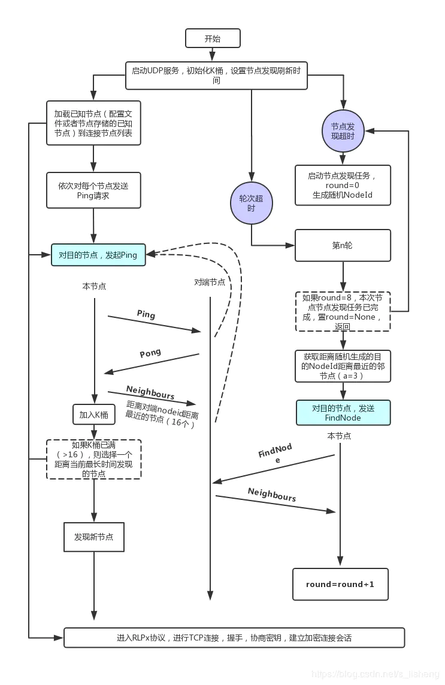

我们知道以太坊是一个公有链，其节点可以自由的加入与退出，但是有一个问题，就是我不知道以太坊网络中正在运行有那些节点，也不知道其节点的信息，但是又需要加入到以太坊网络中，怎么解决这个问题呢？以太坊给出的解决方法是先通过一个已知的节点加入到网络，然后通过节点发现协议发现更多的节点，从而建立连接，以动态维持本节点稳定运行所需的最低连接数。本档前部分翻译自以太坊定义的节点发现协议（版本4），后半部分给出了源码实现的大致流程，以帮助理解。

以太坊节点信息的存储采用的是`Kademlia`分布式哈希表。理解节点发现协议主要是理解分布式哈希表的原理，再加上定义的节点间通信的报文格式，节点ID的定义，距离的计算，加在一起就是以太坊的节点发现协议了。以太坊不同语言版本代码实现上具体细节可能不同但大致流程思想是相同的。


### 第一部分——节点发现协议定义

#### 节点ID
每个节点都有一个`secp256k1`椭圆曲线密码学ID。节点的公钥作为标识或节点ID。节点之间的距离为公钥按位异或或者是公钥的哈希值按位异或。计算公式如下：
```
distance(n₁, n₂) = keccak256(n₁) XOR keccak256(n₂)
```

#### 节点表
节点表在节点发现协议中用于保存邻节点信息。邻节点被存在一个包含有K桶的路由表中。协议中$k=16$，即每个K桶至多含有16个节点条目。每项按时间排序——最新发现更新的节点放在前，其他在后。

每当一个新节点$N_1$被发现，就可以插入相应的桶中。如果桶中少于$k$个条目，$N_1$可添加到桶中第一个条目。如果桶中已含有$k$项，桶中最早发现的节点$N_2$，需要通过发送ping包重新检测其有效性。如果没有收到来自$N_2$的回复则认为该节点已失效（下线），从路由表中移除并将$N_1$添加到桶的前部。

>以太坊文档中`Node Table`一节有部分内容错误， `For each 0 ≤ i < 256, every node keeps a k-bucket for nodes of distance between 2i and 2i+1 from itself.` ，应该是$[2^i,2^{i+1})$ 。建议阅读论文[Kademlia——A Peer-to-peer Information System Based on the XOR Metric](https://pdos.csail.mit.edu/~petar/papers/maymounkov-kademlia-lncs.pdf)。

#### 端点验证
为了预防流量放大攻击，必须验证查询的发送者是否参与了发现协议。如果数据包的发送者在过去12小时内发送了具有匹配ping哈希的有效pong响应，则认为该数据包的发送者已经过验证。

#### 递归查找
一次查找会找到$k$个距离目标节点（这个节点在节点发现时是随机生成的）最近的节点。节点查找发起后先选取$a$个距离目标节点最近的已知节点。随后同时向这些节点发送`FindNode`包。其中，$a$是一个参数，通常可设为3。发起者继续向先前查询到的节点发送`FindNode`，如此不断进行递归。对获知的$k$个离目标节点最近的节点，选取$a$个尚未查询过的节点向其发送`FindNode`。无法快速响应的节点将被排除在外，除非他们做出响应。

如果一轮`FindNode`查询失败，即没有返回任何一个比目前节点中更近的节点，那么将会继续向$k$个最近节点未被查询过的节点中发送`FindNode`。

>对节点发现过程的背后原理逻辑，其实就是我不知道网络上有那些节点，但我又想找到他们，因为我现在不知道其具体的节点ID，干脆我自己随机生成一个节点ID（不管它是不是真实存在），然后我去查找距离这个节点ID最近的若干真实节点，我向邻节点说，你们要给我你们自己知道的距离这个节点ID最近的节点并返回给我。我收到后，再继续从最近的节点中再次发起查找过程，一步一步获取更多逼近该随机生成的节点ID的过程。也就是说，这个随机生成的节点ID也许并不存在真实的节点，只是为了找到距离其最近的真实节点而随机生成的一个节点ID，当然这里的距离也是逻辑距离，并不是真实的距离。

#### 报文协议
节点发现协议报文都是UDP报文，报文中最大的是1280字节。
```
packet = packet-header || packet-data
```
数据包头部：
```
packet-header = hash || signature || packet-type
hash = keccak256(signature || packet-type || packet-data)
signature = sign(packet-type || packet-data)
```
当在同一UDP端口上运行多个协议时，`hash`可使分组格式可识别。除此并无其他目的。每个包都由节点公钥来签名，签名是一个编码长度为65字节数组，签名值`r，s`，签名验证值`v`。

消息类型`packet-type`占单字节。包有效数据在消息类型后面。数据包头部之后的数据用RLP进行编码。根据EIP-8，实现应忽略列表中的任何其他元素以及列表后的任何额外数据。

**Ping Packet (0x01)**
```
packet-data = [version, from, to, expiration]
version = 4
from = [sender-ip, sender-udp-port, sender-tcp-port]
to = [recipient-ip, recipient-udp-port, 0]packet-data = [ver
```
`expiration`字段是UNIX时间戳，如果一个数据包的时戳过期了可能会无法处理。收到ping数据包后，接收节点应回复pong数据包。并可考虑将发送节点添加到节点表中。

如果在过去12小时内未与发送方进行任何通信，则除了pong之外还应发送ping以验证对端节点。

**Pong Packet (0x02)**
```
packet-data = [to, ping-hash, expiration]
```
Pong是ping的响应。`ping-hash`须与相应的ping包`hash`一致。实现时应该忽略那些不含有ping包`hash`的pong包。

**FindNode Packet (0x03)**
```
packet-data = [target, expiration]
```
`FindNode`包用于请求距离目的节点近的节点。目标节点ID是一个65字节长度的`secp256k1`椭圆曲线公钥。当接收到`FindNode`，接收端需要回复在本地节点表中距离请求目的节点最近的16个节点。

为了对抗流量放大攻击，只有被验证过的`FindNode`发送者才会被回复邻节点信息。

**Neighbors Packet (0x04)**
```
packet-data = [nodes, expiration]
nodes = [[ip, udp-port, tcp-port, node-id], ... ]
```
`FindNode`包的响应。

#### 存在的问题及建议
凡含有`expiration`字段的数据包都是用于防止数据重放的。因为是绝对时间戳，节点时钟必要要十分准确以正确验证时戳的有效性。自从2016年协议发布后起，已经接收到无数的因为用户的时钟不准确造成的错误报告。

端点验证是不严密是因为`FindNode`的发送方永远法确定接收端十分接收到足够的pong。Geth按如下方式处理：如果在最近12小时内未与收件人进行通信，请通过发送ping启动该过程。等待来自另一方的ping，回复它然后发送`FindNode`。


### 第二部分——节点发现协议代码实现流程
#### 流程图


#### 节点如何加入到对应的K桶
计算节点之间的距离很简单，直接按位异或后的值即为两节点之间的距离值，但节点应该加入那个K桶呢？可以公钥哈希值按位异或后最高位的值（例如： 异或值`0000 ... 0000 0101`，则桶距离为3 ），则将节点放入第3个桶中。

为什么？

主要是要理解二叉树的拆分过程：
对每一个节点，都可以**按照自己的视角**对整个二叉树进行拆分。拆分的规则是：先从根节点开始，把**不包含**自己的那个子树拆分出来；然后在剩下的子树再拆分不包含自己的下一层子树；以此类推，直到最后只剩下自己。

拆分的最后一个K桶（距离自己最近的那个K桶），只有最后1位不同，异或值为`0000 ... 0000 0001`，最高位为1，第一个K桶；拆分的倒数第二个K桶，异或值为`0000 ... 0000 001x`，最高位为2，第二个K桶；依此类推......


>在具体实现细节上，以太坊节点节点公钥是512位，计算距离时的ID是取节点公钥的哈希，值为256位。所以节点路由表由256个K桶组成，每个K桶最多16个节点。


>参考文档：     
[Node Discovery Protocol v4](https://github.com/ethereum/devp2p/blob/master/discv4.md)  
[聊聊分布式散列表（DHT）的原理——以 Kademlia（Kad） 和 Chord 为例](https://program-think.blogspot.com/2017/09/Introduction-DHT-Kademlia-Chord.html#head-7)       
[Kademlia——A Peer-to-peer Information System Based on the XOR Metric](https://pdos.csail.mit.edu/~petar/papers/maymounkov-kademlia-lncs.pdf)      