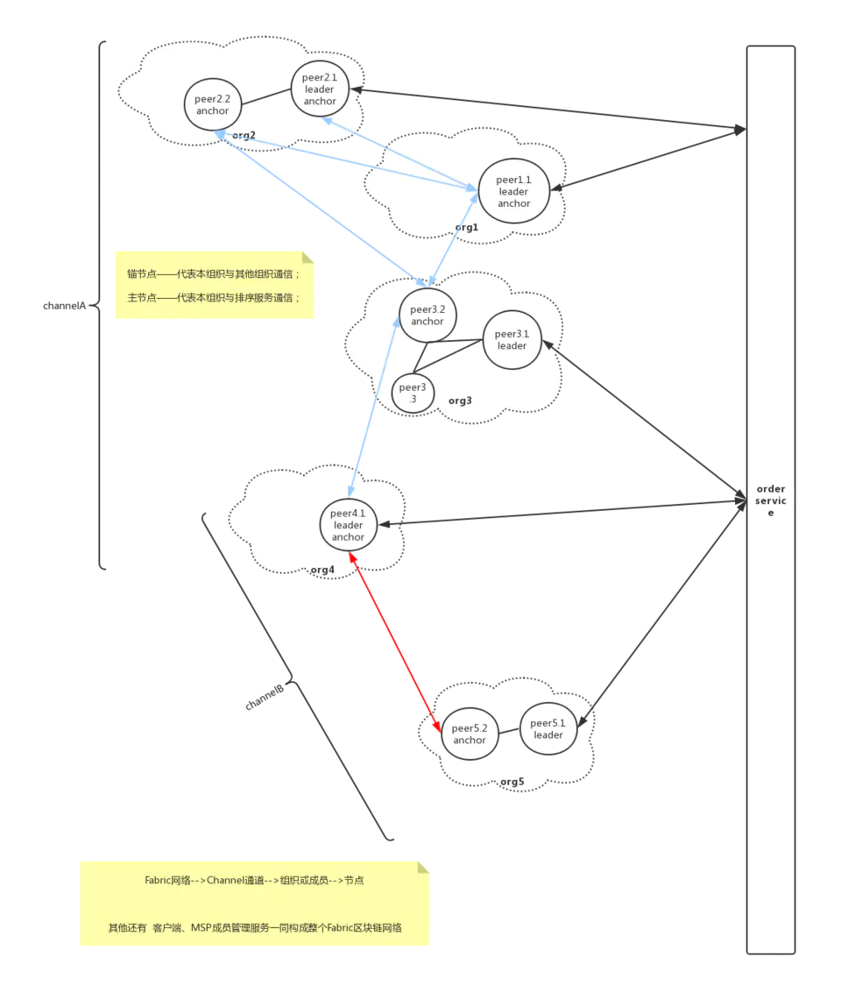
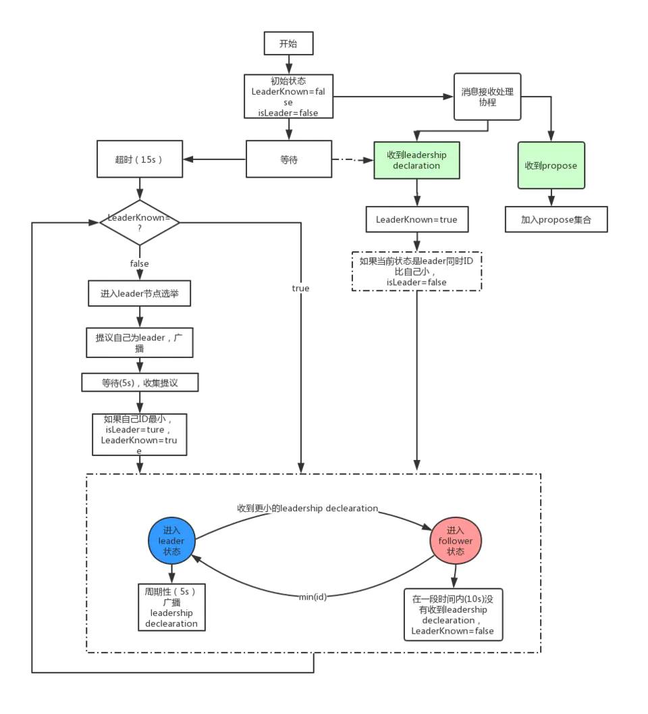

### 一、Fabric网络组织
Fabric网络组织按如下结构组成：Fabric网络-->Channel通道-->组织（成员）-->节点。即整个网络由数个通道组成，每个通道都由多个组织构成，而每个组织内部由数个节点组成（可能由功能或其他划分方式分为多个节点）。如下图所示：

### 二、主节点（leader peer）选举
一个组织（其实是成员）在一个通道上可以有多个Peer节点，这时候为了提高通信效率，需要选举出来一个主节点（leader）作为代表和排序服务节点通信，负责从排序服务节点处获取最新的区块并在组织内部同步。有如下两种方式：
#### 1. 静态指定
配置文件中配置
```yaml
    # Gossip related configuration
    gossip:
        # Defines whenever peer will initialize dynamic algorithm for
        # "leader" selection, where leader is the peer to establish
        # connection with ordering service and use delivery protocol
        # to pull ledger blocks from ordering service
        useLeaderElection: false
        # Statically defines peer to be an organization "leader",
        # where this means that current peer will maintain connection
        # with ordering service and disseminate block across peers in
        # its own organization
        orgLeader: true
```

#### 2. 动态选举
相关配置：
```yaml
    # Gossip related configuration
    gossip:
        # Leader election service configuration
        election:
            # Longest time peer wait for stable membership during leader election startup (unit: second)
            startupGracePeriod: 15s
            # Interval gossip membership sampled to check its stability (unit: second)
            membershipSampleInterval: 1s
            # Time pass since last declaration message before peer decide to go to election (unit: second)
            leaderAliveThreshold: 10s
            # Time between peer sends propose message and declare itself as a leader (sends declaration message) (unit: second)
            leaderElectionDuration: 5s
```

#### 3. leader节点选举流程
选举流程（简要）：
    
    如果当前没有leader，进入选举算法
        如果当前是leader:广播leadership declearation，如果收到比自己小的leadership declearation，自己变为follower;
        如果当前是follower:指定时间内没有收到leadership declearation，则认为leader离线了，进入选举流程

选举算法（简要）:
    
    广播提议自己为leader消息
    各个节点收集选举消息
    比对ID，如果自己ID最小，则自己为leader
详细过程如下图所示：


伪代码实现：
```go
// Gossip leader election module
// Algorithm properties:
// - Peers break symmetry by comparing IDs
// - Each peer is either a leader or a follower,
//   and the aim is to have exactly 1 leader if the membership view
//   is the same for all peers
// - If the network is partitioned into 2 or more sets, the number of leaders
//   is the number of network partitions, but when the partition heals,
//   only 1 leader should be left eventually
// - Peers communicate by gossiping leadership proposal or declaration messages

// The Algorithm, in pseudo code:
//
//
// variables:
// 	leaderKnown = false
//
// Invariant:
//	Peer listens for messages from remote peers
//	and whenever it receives a leadership declaration,
//	leaderKnown is set to true
//
// Startup():
// 	wait for membership view to stabilize, or for a leadership declaration is received
//      or the startup timeout expires.
//	goto SteadyState()
//
// SteadyState():
// 	while true:
//		If leaderKnown is false:
// 			LeaderElection()
//		If you are the leader:
//			Broadcast leadership declaration
//			If a leadership declaration was received from
// 			a peer with a lower ID,
//			become a follower
//		Else, you're a follower:
//			If haven't received a leadership declaration within
// 			a time threshold:
//				set leaderKnown to false
//
// LeaderElection():
// 	Gossip leadership proposal message
//	Collect messages from other peers sent within a time period
//	If received a leadership declaration:
//		return
//	Iterate over all proposal messages collected.
// 	If a proposal message from a peer with an ID lower
// 	than yourself was received, return.
//	Else, declare yourself a leader

```

#### 4. 消息定义
```go
// Leadership Message is sent during leader election to inform
// remote peers about intent of peer to proclaim itself as leader
message LeadershipMessage {
    bytes pki_id        = 1;
    PeerTime timestamp = 2;
    bool is_declaration = 3;
}
```
