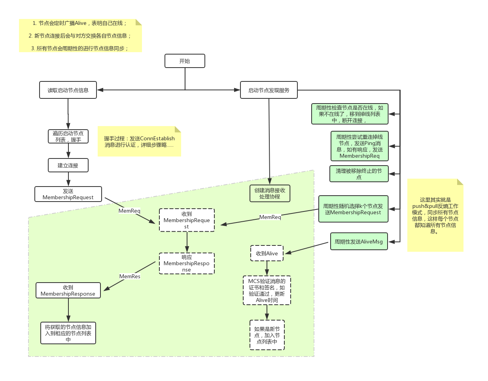

一个新节点通过已知的节点加入到网络中，此时，它所知的网络节点信息是非常有限的，需要通过节点发现获知更多的节点，建立起足够的连接。另外，当一个新节点加入到网络时，原有网络节点也需要通过节点发现感知到新节点的加入。

分布在各地的网络节点总是会有上线离线的变化，有这就需要Fabric网络必须动态维护一个节点成员列表，这就需要节点成员管理。

### 一、节点发现与成员管理

#### 1. 节点发现
一个节点要加入Fabric网络，必须要知道至少一个已知Fabric节点作为启动节点。

相关配置如下：
```yaml
    # Gossip related configuration
    gossip:
        # Bootstrap set to initialize gossip with
        bootstrap: 127.0.0.1:7051
```

Fabric节点发现与成员管理流程如下图所示：


#### 2. 网络连接层次的节点成员管理（在线，掉线）
在线节点(Peer)通过持续不断地广播“活着”的消息，来表明他们的可用性。

>这一部分相当于心跳检测，如果节点离线，就在channel成员列表中删除节点。

#### 3. 相关消息定义
```protobuf
// AliveMessage is sent to inform remote peers
// of a peer's existence and activity
message AliveMessage {
    Member membership  = 1;
    PeerTime timestamp = 2;
    bytes identity     = 4;
}

// MembershipRequest is used to ask membership information
// from a remote peer
message MembershipRequest {
    Envelope self_information = 1;
    repeated bytes known         = 2;
}

// MembershipResponse is used for replying to MembershipRequests
message MembershipResponse {
    repeated Envelope alive = 1;
    repeated Envelope dead  = 2;
}
```

### 二、节点间消息传播（Gossip）
#### 1. 消息发送方式：
- 点对点发送（end to end）
- gossip方式——发送消息时会根据消息类型对节点进行过滤筛选（另外还会去除掉发送节点）后再随机（*具体实现上是随机就近原则*）选择$k$个节点发送消息。

这里采用的是push和pull方式。

#### 2. push
节点有了新消息后，随机选择$k$个节点（例如，3），向它们发送新消息。$k$个节点收到后，继续随机选择$k$个节点发送新信息，直到所有节点都知道该新信息。

#### 3. pull
所有节点周期性的随机选取$k$个（默认配置=3）个节点，向它们获取数据。Fabric中gossip协议pull操作如下：

```go
/* PullEngine is an object that performs pull-based gossip, and maintains an internal state of items
   identified by string numbers.
   The protocol is as follows:
   1) The Initiator sends a Hello message with a specific NONCE to a set of remote peers.
   2) Each remote peer responds with a digest of its messages and returns that NONCE.
   3) The initiator checks the validity of the NONCEs received, aggregates the digests,
      and crafts a request containing specific item ids it wants to receive from each remote peer and then
      sends each request to its corresponding peer.
   4) Each peer sends back the response containing the items requested, if it still holds them and the NONCE.

    Other peer				   			   Initiator
	 O	<-------- Hello <NONCE> -------------------------	O
	/|\	--------- Digest <[3,5,8, 10...], NONCE> -------->     /|\
	 |	<-------- Request <[3,8], NONCE> -----------------      |
	/ \	--------- Response <[item3, item8], NONCE>------->     / \

*/
```

##### 4. pull相关消息定义
```protobuf
// GossipHello is the message that is used for the peer to initiate
// a pull round with another peer
message GossipHello {
    uint64 nonce         = 1;
    bytes metadata       = 2;
    PullMsgType msg_type = 3;
}

// DataDigest is the message sent from the receiver peer
// to the initator peer and contains the data items it has
message DataDigest {
    uint64 nonce             = 1;
    repeated bytes digests  = 2; // Maybe change this to bitmap later on
    PullMsgType msg_type     = 3;
}

// DataRequest is a message used for a peer to request
// certain data blocks from a remote peer
message DataRequest {
    uint64 nonce             = 1;
    repeated bytes digests  = 2;
    PullMsgType msg_type     = 3;
}

// DataUpdate is the final message in the pull phase
// sent from the receiver to the initiator
message DataUpdate {
    uint64 nonce                = 1;
    repeated Envelope data      = 2;
    PullMsgType msg_type        = 3;
}
```