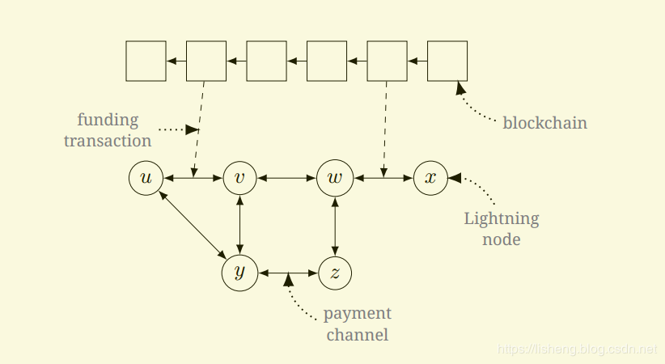
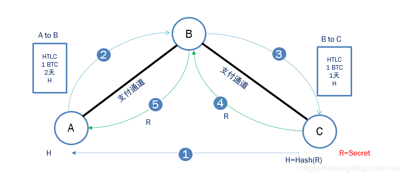

闪电网络属于状态通道技术范畴，是区块链技术的一个发展方向之一，其核心思想是将本来在链上结算的交易在链下通过状态通道维护中间态，并且在发生纠纷时回到链上仲裁。链上仲裁的公平性和安全性在博弈论上保证了链下交易的对手不会作恶。通过这种方式实现扩容。下面是闪电网络技术概要。
### 一、闪电网络——链下扩容方案
#### 【1】当前比特币网络的问题？
我们都知道比特币系统的交易吞吐量是非常之低的，为了解决比特币系统交易吞吐量低的问题，闪电网络被提出，它并不是通过增加区块大小等链上扩容方案，而是一种通过离线交易形式的链下扩容方案。
  
#### 【2】闪电网络解决问题的思路——针对微支付场景
要提升比特币系统的交易吞吐量，直接在链上广播大量的交易是不可行的，吞吐量是有限的，解决的办法是压缩交易。在微支付应用场景下，如果交易双方之间会进行大量的微支付交易，那么将所有这些微支付交易都上链是没有绝对必要的，那些中间状态其实可以不用上链，只要最终所有的微支付交易的最终状态上链就可以了，因为即使所有微支付交易上链，最后的状态也还是最终状态。所以，在链下，记录大量的微支付交易状态信息，而在链上，只对创建状态及最终状态上链。将大量的微支付交易压缩为少量链上交易。这样就大大提升了交易吞吐量。==**简要概括就是：将大量交易放到比特币区块链之外进行，只把关键环节放到链上进行确认。**==

#### 【3】支付通道
**具体的是通过支付通道完成大量微支付交易**。在支付通道打开后，参与方可离线发送任何数量的交易，无需广播到比特币的网络上。除了最开始创建支付通道（funding交易）和关闭支付通道是需要广播上链，其中间的交易过程是由一系列交易记录构成。创建支付通道类似于双发各自建立一个账本用来记录双发的交易记录，当不想再与对方交易时，可以关闭通道，根据账本中的交易记录进行最终结算，上链。


#### 【4】支付通道组网
闪电网络中需要交易双发建立支付通道，但每次与不同的人进行交易都要新建立支付通道是很低效的（占用你大量的资金成本+时间成本）。例如`A->C`进行交易，可以是双发直接创立新的支付通道（`A->C`），但如果`A->B`，`B->C`已建立通道，此时可以通过`A->B->C`的方式进行交易。即，可以用已有的通道进行交易。

这样，随着新创立的支付通道越来越多，最终，所有的支付通道会形成一个巨大的网络，此时，只要你有一条与有这个巨大网络的支付通道，你就可以通过这个巨大的网络与任何人通过支付通道进行交易。

为了维护这个巨大的通道网络，需要激励人们贡献自己的支付通道，就像矿工可以获取手续费一样，如果有人用了你的支付通道，你可以收取一定的费用。当然，你也可以把费用设为负值，即使如果有人使用你的支付通道，你可以给他一笔钱。

到这里，闪电网络就形成了。

#### 二、闪电网络主要工作机制
闪电网络怎么保证链下可信交易？主要依靠RSMC和HTLC，RSMC保障了两个人之间的直接交易可以在链下完成，HTLC保障了任意两个人之间的转账都可以通过一条支付通道来完成。闪电网络整合这两种机制，就可以实现任意两个人之间的交易都在链下完成了。

###### 【1】RSMC
Recoverable Sequence Maturity Contract，序列到期可撤销合约。其主要原理类似资金池机制。

首先假定交易双方之间存在一个“微支付通道”（资金池）。交易双方先预存一部分资金到“微支付通道”里，初始情况下双方的分配方案等于预存的金额。每次发生交易（不能超过预存金额），需要对交易后产生资金分配结果共同进行确认，同时签字把旧版本的分配方案作废掉。 任何一方需要提现时，可以将他手里双方签署过的交易结果写到区块链网络中，从而被确认。从这个过程中可以看到，只有在提现时候才需要通过区块链。

任何一个版本的方案都需要经过双方的签名认证才合法。任何一方在任何时候都可以提出提现，提现时需要提供一个双方都签名过的资金分配方案（意味着肯定是某次交易后的结果，被双方确认过，但未必是最新的结果）。在一定时间内，如果另外一方拿出证明表明这个方案其实之前被作废了（非最新的交易结果），则资金罚没给质疑方；否则按照提出方的结果进行分配。**罚没机制可以确保了没人会故意拿一个旧的交易结果来提现。**

另外，即使双方都确认了某次提现，首先提出提现一方的资金到账时间要晚于对方，这就鼓励大家尽量都在链外完成交易。通过RSMC，可以实现大量中间交易发生在链外。

相关交易：`funding transaction, commitment transaction, closing transaction, penalty transaction`

###### 【2】HTLC
Hashed Time Lock Contract，哈希时间锁合约。这个类似限时转账，通过智能合约，双方约定转账方先冻结一笔钱（发送比特币到一个多重签名地址），并由最终接收方生成的一个密码`R`的哈希值`H(R)`加锁，如果在一定时间内接收方知晓了密码`R`，使得它哈希值`H(R)`跟已知值匹配（实际上意味着转账方授权了接收方来提现），则这笔钱转给接收方。如果约定时间内，接收方未知晓密码`R`，则转账方可取回已冻结资金。主要由2部分构成：
- 哈希值锁定，确保了只有知晓最终接收方生成的密码`R`才可以解锁（即确保最终接收方已经拿到比特币后，中间节点才可以解锁去币，在最终接收方拿到比特币前，中间节点是无法知晓密码`R`的）。
- 时间锁定，即确保了转账方在一定时间内（最终接收方解锁取走比特币前）无法取走，又能保证在一段时间后如果最终接收方没有取走比特币的情况下，转账方可以拿回自己的比特币。


举个例子：A经过B向C转账1个比特币，过程如下：
1. C随机生成一个密码`R`，计算哈希值`H(R)`，发给A；
2. A用哈希值`H(R)`创建和B的HTLC合约：A转1比特币给一个多重签名地址Q，如果B能在2天内知晓密码`R`，解锁Q，取到A支付的1个比特币；如果2天内，B没有`R`，2天后Q解锁，A取回自己支付的1个比特币。
3. B用哈希值`H(R)`创建和C的HTLC合约：B转1比特币给一个多重签名地址，如果C能在1天内知道密码`R`，则解锁，取到B支付的1个比特币；如果1天内，C无法知晓密码`R`，1天后解锁，B取回自己支付的1个比特币。
4. 密码`R`是C生成的，它自然知晓密码`R`，所以C能在1天内，解锁B的HTLC，取到B支付的1个比特币。在这个过程中，B也看到了密码`R`。
5. 在C解锁B后，B知晓了密码`R`，依此B解锁A，取到A支付的1个比特币。
6. 至此，A给了B一个比特币，B给了C一个比特币，等同于A给了C一个比特币，转账完成。

#### 三、闪电网络——路由部分
如果交易的双发都加入了这个支付通道网络，你就可以通过这个支付通道网络与任何加入闪电网络的交易方进行交易。具体的，在确定了你的交易接收方后，你需要选择中间节点构建一条发起者到接收者的路由去完成交易。如何建立这条路径呢？

##### 【1】节点及通道发现

仅仅知道当前有哪些节点，本节点连接了哪些节点，这些信息是不够的。你需要知道当前网络拓扑以及各个支付通道的费用、离线余额等更多信息，才能选择一条满足要求的最佳路径。这就需要一个实现一个协议来同步全网的网络拓扑以及支付通道的费用、离线余额等信息。这里使用Gossip协议对这些信息进行同步。

主要同步节点和通道信息：
- 同步通道信息，使得我们维护一个全网通道网络拓扑，以进行路由选择。
- 同步节点信息，使得节点间建立连接以及建立支付通道。

相关消息：`channel_announcement`、`node_announcement`、`channel_update`等


##### 【2】路由算法选择最佳路径
有了上面这些信息，我们就能设计路由算法来建立这条路径。前面提到，进行交易时它们需要先建立一个通道，中间会经过若干支付通道，会有很多路由选择，不同的通道交易费用不同，同时有些通道可能不满足要求（额度太小），考虑到经过太多的支付通道也是不好的，最好有路由跳数的限制，即，选择一条经过有限跳数的的费用最低的一条路径。综上，这个路由算法归结为一个在有限跳数(闪电网络设为20)条件下，带有（负）权值的单源最短路径问题（这里路径中权值指的是费用，费用可能为正，也可能为负）。

解决这个问题的路由算法就是：Bellman-Ford-Gibson
```c
/* Bellman-Ford-Gibson: like Bellman-Ford, but keep values for every path length. */
```

构建通道时，满足条件的路由没有找到怎么办？与对方新创建直接支付通道。


##### 【3】 （补充）闪电网络规模巨大时的路由方案——[Flare](https://bitfury.com/content/downloads/whitepaper_flare_an_approach_to_routing_in_lightning_network_7_7_2016.pdf)
Flare，一种用于闪电网络支付路由的混合路由算法。是一种两阶段(proactive and reactive )算法：       
(1) 主动更新节点的路由图，存储有关网络拓扑的信息；  
(2) 根据闪电网络请求的需要，按需被动收集信息。

考虑闪电网络的节点规模，闪电网络相互连接的节点可能会达到数以百万计。此时现有的路由方案可能无法满足要求。可采用Flare路由方案。

>该路由算法借鉴了[MANET（移动自组织网络）](https://en.wikipedia.org/wiki/Mobile_ad_hoc_network)路由算法的思路。

##### 【4】 洋葱路由
经过前面的路由算法确定了一条路径。发送数据时需要一跳一跳的（` origin node --> hop --> ... --> hop --> final node`）经过中间节点最终到达目的节点。如何确保数据的安全性及满足一定程度的匿名隐私保护要求？例如，发送的数据只有最终目的节点可以看到，中间节点无法知道数据。

为了满足上面要求，闪电网络的“路由部分”的一个重要特性是匿名网络路径。只有发起节点知道完整路线，其他节点只知道上一跳和下一跳节点。具体实现是通过[Sphinx](https://cypherpunks.ca/~iang/pubs/Sphinx_Oakland09.pdf)方案的洋葱路由协议。

在洋葱路由的网络中，消息一层一层的加密包装成像洋葱一样的数据包，每经过一个节点会将数据包的最外层解密，直至目的地时将最后一层解密，目的地因而能获得原始消息。而因为透过这一系列的加密包装，每一个网络节点（包含目的地）都只能知道上一个节点的位置，但无法知道整个发送路径以及原发送者的地址。

>参考文档：  
[The Bitcoin Lightning Network: Scalable Off-Chain Instant Payments](https://lightning.network/lightning-network-paper.pdf)     
[Lightning Network Specifications](https://github.com/lightningnetwork/lightning-rfc)       
[Bellman–Ford algorithm](https://en.wikipedia.org/wiki/Bellman%E2%80%93Ford_algorithm)       
[Routing, Dijkstra, Bellman-Ford and BFG!](https://medium.com/@rusty_lightning/routing-dijkstra-bellman-ford-and-bfg-7715840f004)     
[Flare: An Approach to Routing
in Lightning Network](https://bitfury.com/content/downloads/whitepaper_flare_an_approach_to_routing_in_lightning_network_7_7_2016.pdf)        
[Tor: The Second-Generation Onion Router](https://pdfs.semanticscholar.org/b859/4769692b7cac6f19f48a29f8a9b1a41f526b.pdf)        
[Sphinx: A Compact and Provably Secure Mix Format](https://cypherpunks.ca/~iang/pubs/Sphinx_Oakland09.pdf)     

