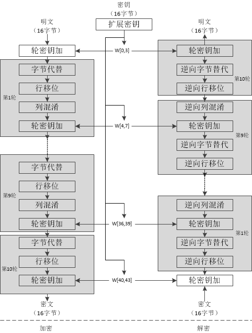
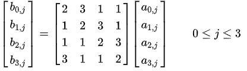

密码学博大精深，这里所说的AES加密算法原理可以理解为AES工作流程，至于为什么这么设计，这么设计为什么是安全的，有待今后的学习与思考。

### 分组密码设计的两个原则

分组密码设计的两个原则：混淆(confusion)和扩散(diffusion)，其目的是抗击敌手对密码系统的统计分析。

- 混淆是使密文的统计特性与密钥的取值之间的关系 尽可能复杂化，以使密钥和明文以及密文之间的依赖性对密码分析者来说是无法利用的。
- 扩散的作用就是将每一位明文的影响尽可能迅速地作用到较多的输出密文位中，以便在大量的 密文中消除明文的统计结构，并且使每一位密钥的影响尽可能迅速地扩展到较多的密文位中，以防对密钥进行逐段破译。

在后面的AES算法设计的过程中可以看到其核心步骤符合这两个原则。

### AES的构造方法
AES分组密码为128bit的分块长度，密钥长度为128、192、256bit，密钥长度影响密钥编排（即在每一轮中使用的子密钥）和轮的次数，但是不影响每一轮中的高级结构。

主要分如下几个过程：
1. KeyExpansion: 密钥扩展，每一轮轮密钥都是不同的，需要依据密钥扩展为不同轮次的128bit轮密钥。
2. Initial round key addition: 初始轮密钥加
    1. AddRoundKey
3. 9,11 or 13round: (密钥长度不同，轮数不同)
    1. SubBytes
    2. ShiftRows
    3. MixColumns
    4. AddRoundKey
4. Final round(making 10,12 or 14 rounds in total):
    1. SubBytes
    2. ShiftRows
    3. AddRoundKey

AES128算法流程如下图所示：      
   

#### KeyExpansion（密钥扩展）
每一轮使用的密钥都是根据上一轮的密钥变换而来的，由密钥生成不同轮次轮密钥的算法过程可参考[AES key schedule](https://en.wikipedia.org/wiki/AES_key_schedule)，这里不再细述。

#### SubBytes（字节替代）
字节替代，就是依据S盒（Subtitution Box）把明文块的每一个字节都替代成另外一个字节，`b[i,j] = S(a[i,j])`， 实现时直接查表即可。

 

#### ShiftRows（行移位）

      

这一步就像图中所描述的：第一行不变，第二行循环左移1个字节，第三行循环左移2个字节，第四行循环左移3个字节。

#### MixColumns（列混淆）
输入数组的每一列要和一个常量矩阵做矩阵相乘，得到对应的输出列。

     

#### AddRoundKey（轮密钥加）
128bit的轮密钥同样被排列成4X4的矩阵，输出值`b[i,j] = a[i,j] XOR k[i,j]`。       

           

>参考资料：     
[Advanced Encryption Standard](https://en.wikipedia.org/wiki/Advanced_Encryption_Standard)    
[FIPS 197, Advanced Encryption Standard (AES)](https://nvlpubs.nist.gov/nistpubs/FIPS/NIST.FIPS.197.pdf)          
[并行加密算法系列（三）之AES on Intel CPU](https://blog.csdn.net/Canhui_WANG/article/details/78785658)
[并行加密算法系列（四）之AES on Nvidia GPU](https://blog.csdn.net/Canhui_WANG/article/details/78785675)

---
>最后应用AES加密算法时，遇到了性能瓶颈，需要提高AES加密算法的吞吐量，目前有2个思路，一个是硬件加速，AES-NI，但这个加速目前测的最多能提升10倍左右，吞吐量还是不够，还有一个思路是GPU加速，在CTR模式下进行并行计算加速，这个目前还没有实现并进行测试，可参考这篇[GPU accelerated AES in counter mode](https://www.andrew.cmu.edu/user/aspratt/accelerated_aes/)。