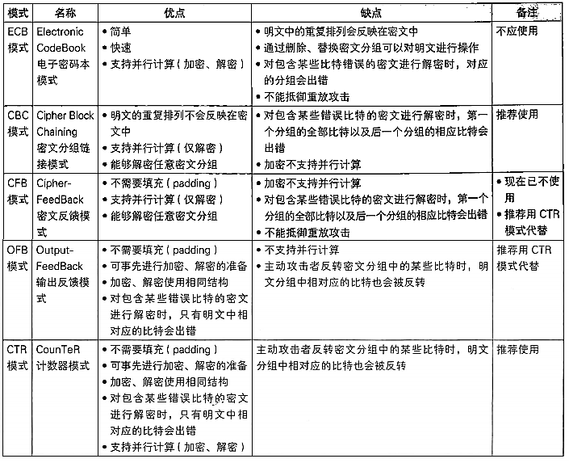

### 对称密码算法
常用对称密码算法AES、Blowfish、DES、RC5等，DES目前认为已不安全，当前使用最多的是AES加密算法，因其应用的广泛，目前主流CPU已经实现了AES-NI（全称是：Advanced Encryption Standard New Instructions），这是针对AES加密算法的硬件加解密CPU指令集。通过硬件加速，能实现吞吐量成倍的提升。所以这里重点学习AES加密算法。

>这里还需要列出常见的轻量级分组密码算法：LET、GOST、TWINE等，这类算法主要应用在对硬件资源要求比较敏感的情况，比如物联网等。

### 分组密码算法

分组密码算法只能加密固定长度的分组，但是需要加密的明文长度通常会超过分组密码的分组长度，这时候就需要对分组密码算法进行迭代，才能把所有的明文进行加密，而迭代的方法就称为分组密码的模式。分组密码有很多模式，比较常见的有下面五种：
- ECB模式：Electronic CodeBook mode(电子密码本模式)
- CBC模式:Cipher Block Chainiing mode(密码分组链接模式)
- CFB模式:Cipher FeedBack mode(密文反馈模式)
- OFB模式:Output FeedBack mode(输出反馈模式)
- CTR模式:CounTeR mode (计数器模式)         

#### ECB模式
ECB模式最简单，可以快速理解分组密码是怎么回事，但最不推荐使用。         
     
                 

可以看到就是将非常长的原文分割成一组组128bit块，对每块进行加密，再按顺序将加密后的分组密文组装在一起，形成最终密文。这里最大的问题是相同的原文片段产生相同的密文，这是很危险的，所以这种模式不推荐使用。

#### CBC模式
这种模式克服了ECB模式的缺点，加密过程为将当前分组明文与上一分组密文异或后再块加密得到当前分组密文，解密过程为将当前分组密文块解密后与上一分组密文异火得到当前分组明文。

     

#### CFB模式
CFB模式与CBC模式有点类似，加密过程为将上一分组密文块加密后与当前分组明文异或生成当前分组密文，解密过程为上一分组密文块加密后与当前分组密文异或后解密为当前分组明文。

  
   

#### OFB模式
加解密过程直接看下面图吧

#### CTR模式
这个模式推荐使用，该模式的一个非常大的优点是加解密过程皆可以并行，可以使用GPU进行加速。（可以用CUDA编写AES加速）

通过Nonce随机数（等同于上面的IV）确定计数器的基数，之后每个分组计数器Counter加1。CTR模式中加解密都是对每个分组的计数器Counter进行块加密，之后，加密过程为与该分组明文异或得到该分组的密文，解密过程为与该分组密文异火得到该分组明文，非常好理解（需要注意的是这里解密过程中用的是块加密而不是块解密）。

#### 不同分组模式对比
对比如下图所示：

   

>更多可参考[Block cipher mode of operation](https://en.wikipedia.org/wiki/Block_cipher_mode_of_operation)

### AES测试
为了加深对AES的理解即相关性能的认识，对AES进行了不严格的测试，测试中算法引用的是Rust语言实现的[rust-crypto](https://github.com/DaGenix/rust-crypto/)密码库，所以，需要注意，这里测试的绝对值结果仅适用于本库的情况，相对值能一定程度的代表算法的一般情况。

>测试用的环境： Ubuntu16.04LTS 4核8G Intel(R) Core(TM) i7-6700 CPU @ 3.40GHz

这里测试了AES-128、AES-256，经过测试，AES-128的性能是AES-256的30%~40%左右，也较为符合理论计算，AES密钥长度每增加64位，算法就增加2轮，128位轮数为10轮、192位轮数为12轮、256位轮数为14轮。

对10M数据进行加密，AES-128耗时500ms左右，AES-256耗时700ms左右。可以估算出这里AES-128的吞吐量大概为20M/s，AES-256的吞吐量大概为15M/s，与其他资料50~60M/s的数据有出入，可能是测试用的环境不同，是否支持AES-NI，引用的算法库不同等原因造成的。

一般情况下，AES-128的安全强度已经足够，平衡安全性与性能建议使用AES-128，对安全要求非常高的情况下使用AES-256。

另外测试了硬件加速情况下加解密性能，目前主流CPU已经实现了AES-NI（全称是：Advanced Encryption Standard New Instructions），这是针对AES加密算法的硬件加解密CPU指令集。

对比AES-NI对比没有用硬件加速快8 ~ 10倍左右，10M耗时70~100ms左右。

补充一下，这里测试使用的是AES-CTR模式，相比其它分组模式，这种模式是应用中较为推荐的。

测试代码[cryptotest](./cryptotest)

---
>参考资料：     
[Advanced Encryption Standard](https://en.wikipedia.org/wiki/Advanced_Encryption_Standard)           
[Intel® Advanced Encryption Standard Instructions (AES-NI)](https://software.intel.com/en-us/articles/intel-advanced-encryption-standard-instructions-aes-ni/)