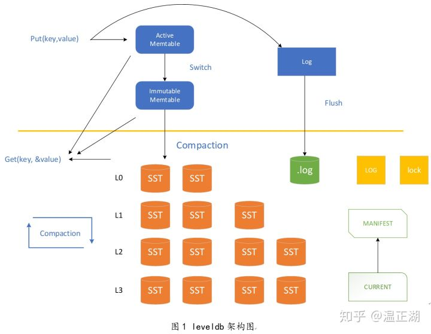

本篇主要讲一下leveldb的工作原理，leveldb是一个非常有名的KV数据库，像比特币、以太坊等区块链底层的数据库都是leveldb数据库。所以我们需要学习一下leveldb的工作原理，理解在使用leveldb数据库时背后都发生了什么。

---
#### 如果让你自己设计，你怎么设计呢？

如果让你设计一个KV数据库，你会怎么设计呢？ 首先要想一下这个问题，这里需要的是持久化存储的KV数据库，不是内存数据库。既然要持久存储，最终数据肯定是要落盘的，以文件的形式存储在磁盘上，也可以是其他存储介质。我们将key-Value数据写入磁盘后，后面查找的时候可以根据Key将磁盘文件中的Value读出来，这就是一个最最原始的数据库了，但这样后面读的时候是个问题？一般的方法，可以建立索引，我们是以Key来查找对应Value数据的，我们可以维护一个索引文件，里面维护有每个Key对应的Value在那个文件的那个位置上。这样，每次读数据时先在索引文件找Key，再找到Value的位置，再访问数据。但是索引文件中怎么找Key最块呢？问题还有很多，不同Key的Value数据在文件中怎么排列呢？每个文件多大合适呢？是每次写都要立即写入磁盘吗？那样写性能肯定受限。具体上次应用是强调读性能还是写性能？越想问题越多。


#### leveldb的设计思路
leveldb回答了我们上面碰到的所有问题。最核心的一条，将Key排序，按序存储。排序的目的是为了查找。在内存中，维护一个跳跃链表skiplist，所有数据库的相关操作都先在内存的skiplist中进行处理，当然为了防止突然掉电关机等造成数据丢失，会在内存之外，额外维护一个日志文件，用来在这种情况下对数据进行恢复。那什么时候存入磁盘呢？当内存中的skiplist超过一定的大小后，将数据转为immutable memtable,即只读的memtable。由后台compaction线程负责将`immutable memtable` dump成sstable文件, 即L0层SST。

但这样是有问题的，因为由`immutable memtable`dump成的sstable文件，随着不断的`Put`写操作，会存在多个L0层SST文件，这样就造成了不同L0层SST中的key是存在重叠的，因为相对而言，所有L0层而言，他们都是部分排序，并不是全排序，这样存储的问题是，即浪费存储空间又影响查找效率。所以，要在L0的基础上，继续进行compaction，将L0层的SST文件归并为L1层SST。此时，L1层因为进行了归并排序，key没有重叠。就这样就可以了吗？如果只有两层，那么每次进行归并时，相当于所有数据都要进行归并，数据量过大，对性能影响较大，怎么办呢？可以进行多层SST设计，当每一层的数据达到一定容量后触发向下一层的归并操作，每一层的数据量比上一层成倍增长，这样就即避免了每次参与归并操作的数据量过大，又一定程度上优化了读操作，leveldb最多可以到7层。




下面我们看一下，leveldb中的读、写、删除具体是怎么做的。最简单的是读，即因为数据的流向是`memtable`->`immutable memtable`->SST文件，所以，读的时候，也是这个读顺序，如果`memtable`中有对应key，则返回value，如果没有，读`immutable memtable`，同样的，如果`immutable memtable`中没有，则读SST文件。因为应用时，很多场景都是读取最近操作的数据，这样的场景下，这样的设计效率是非常之高的，相当于做了一层又一层的缓存，由快到慢，由小到大。写和删除有点类似，写操作，如果是之前没有写过的key，比较容易理解，直接写入`memtable`即跳跃链表中就可以了，超过大小后，会转为`immutable memtable`，进而转为SST存贮在磁盘上，即使还每来的及写入SST文件宕机了，也可以利用WAL写在log中文件的数据进行恢复，而如果是更新一个已有的key的value或者删除也是类似，leveldb中并不是先查到到key再写入新的value或者删除，而是直接新写入同一key的value到`memtable`，value的更新或者删除，会在归并时完成。那还没归并完，此时进行读怎么办？因为读的顺序是先从`memtable`到`immutable memtable`再到SST，所以，确保了一定可以读到最新的写的值，即使归并没有完成。为什么这么设计呢？因为普通机械磁盘的性质决定的，对于普通机械磁盘顺序写的性能要比随机写大很多，所以，在涉及到数据库具体的存储优化时，要看具体的存储介质的性质进行优化，同时也要看应用的具体场景。

#### WAL（Write-ahead Log）
WAL机制即先写日志数据，后写用户数据，这样保证了用户数据持久化，在数据库意外宕机时，可以利用WAL进行恢复。


#### 相关源码
leveldb中对KV操作的抽象接口。其操作有点类似于`HashMap`一类的数据结构。
```c++
// A DB is a persistent ordered map from keys to values.
// A DB is safe for concurrent access from multiple threads without
// any external synchronization.
class DB {
 public:
  // Open the database with the specified "name".
  // Stores a pointer to a heap-allocated database in *dbptr and returns
  // OK on success.
  // Stores NULL in *dbptr and returns a non-OK status on error.
  // Caller should delete *dbptr when it is no longer needed.
  static Status Open(const Options& options,
                     const std::string& name,
                     DB** dbptr);

  DB() { }
  virtual ~DB();

  // Set the database entry for "key" to "value".  Returns OK on success,
  // and a non-OK status on error.
  // Note: consider setting options.sync = true.
  virtual Status Put(const WriteOptions& options,
                     const Slice& key,
                     const Slice& value) = 0;

  // Remove the database entry (if any) for "key".  Returns OK on
  // success, and a non-OK status on error.  It is not an error if "key"
  // did not exist in the database.
  // Note: consider setting options.sync = true.
  virtual Status Delete(const WriteOptions& options, const Slice& key) = 0;

  // Apply the specified updates to the database.
  // Returns OK on success, non-OK on failure.
  // Note: consider setting options.sync = true.
  virtual Status Write(const WriteOptions& options, WriteBatch* updates) = 0;

  // If the database contains an entry for "key" store the
  // corresponding value in *value and return OK.
  //
  // If there is no entry for "key" leave *value unchanged and return
  // a status for which Status::IsNotFound() returns true.
  //
  // May return some other Status on an error.
  virtual Status Get(const ReadOptions& options,
                     const Slice& key, std::string* value) = 0;

  // Return a heap-allocated iterator over the contents of the database.
  // The result of NewIterator() is initially invalid (caller must
  // call one of the Seek methods on the iterator before using it).
  //
  // Caller should delete the iterator when it is no longer needed.
  // The returned iterator should be deleted before this db is deleted.
  virtual Iterator* NewIterator(const ReadOptions& options) = 0;

  // Return a handle to the current DB state.  Iterators created with
  // this handle will all observe a stable snapshot of the current DB
  // state.  The caller must call ReleaseSnapshot(result) when the
  // snapshot is no longer needed.
  virtual const Snapshot* GetSnapshot() = 0;

  // Release a previously acquired snapshot.  The caller must not
  // use "snapshot" after this call.
  virtual void ReleaseSnapshot(const Snapshot* snapshot) = 0;

  // DB implementations can export properties about their state
  // via this method.  If "property" is a valid property understood by this
  // DB implementation, fills "*value" with its current value and returns
  // true.  Otherwise returns false.
  //
  //
  // Valid property names include:
  //
  //  "leveldb.num-files-at-level<N>" - return the number of files at level <N>,
  //     where <N> is an ASCII representation of a level number (e.g. "0").
  //  "leveldb.stats" - returns a multi-line string that describes statistics
  //     about the internal operation of the DB.
  //  "leveldb.sstables" - returns a multi-line string that describes all
  //     of the sstables that make up the db contents.
  //  "leveldb.approximate-memory-usage" - returns the approximate number of
  //     bytes of memory in use by the DB.
  virtual bool GetProperty(const Slice& property, std::string* value) = 0;

  // For each i in [0,n-1], store in "sizes[i]", the approximate
  // file system space used by keys in "[range[i].start .. range[i].limit)".
  //
  // Note that the returned sizes measure file system space usage, so
  // if the user data compresses by a factor of ten, the returned
  // sizes will be one-tenth the size of the corresponding user data size.
  //
  // The results may not include the sizes of recently written data.
  virtual void GetApproximateSizes(const Range* range, int n,
                                   uint64_t* sizes) = 0;

  // Compact the underlying storage for the key range [*begin,*end].
  // In particular, deleted and overwritten versions are discarded,
  // and the data is rearranged to reduce the cost of operations
  // needed to access the data.  This operation should typically only
  // be invoked by users who understand the underlying implementation.
  //
  // begin==NULL is treated as a key before all keys in the database.
  // end==NULL is treated as a key after all keys in the database.
  // Therefore the following call will compact the entire database:
  //    db->CompactRange(NULL, NULL);
  virtual void CompactRange(const Slice* begin, const Slice* end) = 0;

 private:
  // No copying allowed
  DB(const DB&);
  void operator=(const DB&);
};
```


DB数据在内存中的存储方式`MemTable`，内部采用跳跃链表实现。
```c++
class MemTable {
 public:
  // MemTables are reference counted.  The initial reference count
  // is zero and the caller must call Ref() at least once.
  explicit MemTable(const InternalKeyComparator& comparator);

  MemTable(const MemTable&) = delete;
  MemTable& operator=(const MemTable&) = delete;

  // Increase reference count.
  void Ref() { ++refs_; }

  // Drop reference count.  Delete if no more references exist.
  void Unref() {
    --refs_;
    assert(refs_ >= 0);
    if (refs_ <= 0) {
      delete this;
    }
  }

  // Returns an estimate of the number of bytes of data in use by this
  // data structure. It is safe to call when MemTable is being modified.
  size_t ApproximateMemoryUsage();

  // Return an iterator that yields the contents of the memtable.
  //
  // The caller must ensure that the underlying MemTable remains live
  // while the returned iterator is live.  The keys returned by this
  // iterator are internal keys encoded by AppendInternalKey in the
  // db/format.{h,cc} module.
  Iterator* NewIterator();

  // Add an entry into memtable that maps key to value at the
  // specified sequence number and with the specified type.
  // Typically value will be empty if type==kTypeDeletion.
  void Add(SequenceNumber seq, ValueType type, const Slice& key,
           const Slice& value);

  // If memtable contains a value for key, store it in *value and return true.
  // If memtable contains a deletion for key, store a NotFound() error
  // in *status and return true.
  // Else, return false.
  bool Get(const LookupKey& key, std::string* value, Status* s);

 private:
  friend class MemTableIterator;
  friend class MemTableBackwardIterator;

  struct KeyComparator {
    const InternalKeyComparator comparator;
    explicit KeyComparator(const InternalKeyComparator& c) : comparator(c) {}
    int operator()(const char* a, const char* b) const;
  };

  typedef SkipList<const char*, KeyComparator> Table;       // 跳跃链表实现

  ~MemTable();  // Private since only Unref() should be used to delete it

  KeyComparator comparator_;
  int refs_;
  Arena arena_;
  Table table_;
};
```


数据库的读写删除等各种操作都是首先在内存中进行处理，然后才是磁盘上的文件。
