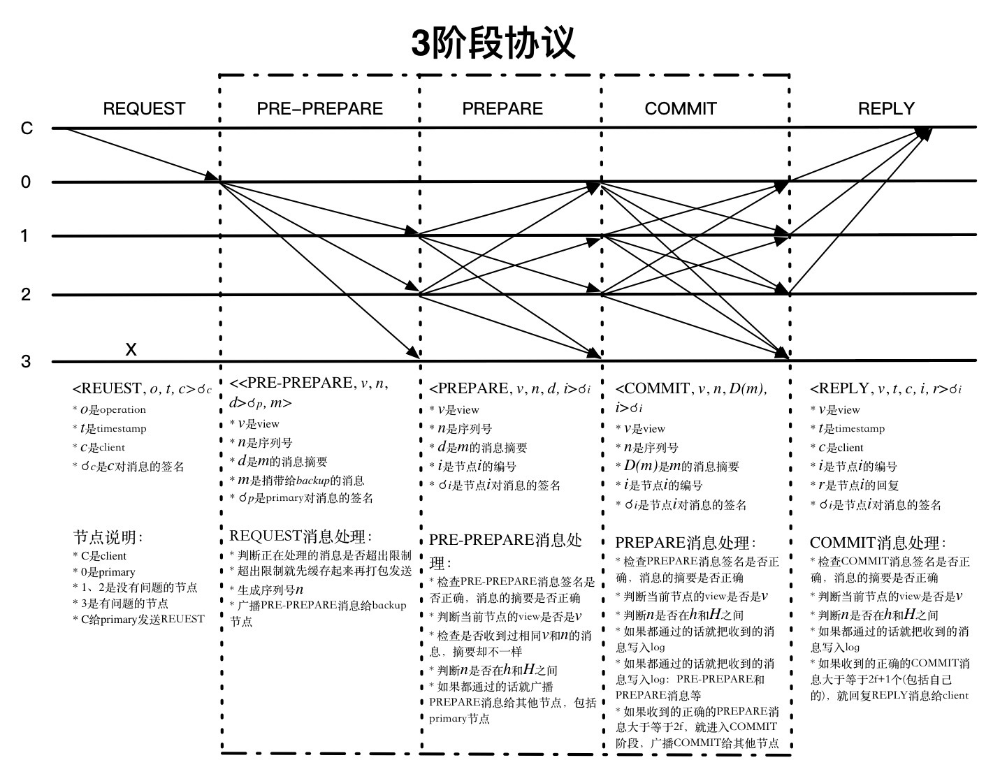

### 拜占庭将军问题
我们已知的共识算法，Paxos、Raft解决的都是非拜占庭问题，也就是可以容忍节点故障，消息丢失、延时等，但节点不能有恶意节点。但如何在有恶意节点存在的情况下达成共识呢？BFT共识算法就是解决这一问题的。即不但能容忍节点故障，还能容忍一定的恶意节点或者说拜占庭节点的存在。我们下面就学习一下BFT算法中的PBFT（Practical Byzantine Fault Tolerance）。BFT算法有非常多的变种，这里只学习PBFT，其他的可以举一反三。

### PBFT
PBFT核心由3个协议组成：一致性协议、检查点协议、视图更换协议。系统正常运行在一致性协议和检查点协议下，只有当主节点出错或者运行缓慢的情况下才会启动视图更换协议，以维持系统继续响应客户端的请求。下面详解这3个子协议。在讲一致性协议之前，我们屏蔽算法细节先看一下正常情况下大致是怎么工作的，大致流程如下：
1. 客户端发送请求给主节点（如果请求发送给了从节点，从节点会将该请求转发给主节点或者将主节点的信息告知客户端，让客户端发送给主节点）。
2. 主节点将请求广播给从节点。
3. 主从节点经过2轮投票后执行客户端的请求并响应客户端。（协议细节见下面的一致性协议）
4. 客户端收集到来着`f+1`个不同节点的相同的响应后，确认请求执行成功。（因为最多有`f`个恶意节点，`f+1`个相同即能保证正确性）。

#### 一致性协议
**一致性协议的目标是使来自客户端的请求在每个服务器上都按照一个确定的顺序执行。** 在协议中，一般有一个服务器被称作主节点，负责将客户端的请求排序；其余的服务器称作从节点，按照主节点提供的顺序执行请求。所有的服务器都在相同的配置信息下工作，这个配置信息称作视图view，每更换一次主节点，视图view就会随之变化。协议主要分`pre-prepare`、`prepare`、`commit`三阶段，如下图所示：

**REQUEST**: 
首先是客户端发起请求， 请求`<REQUEST,o,t,c>`中时间戳`t`主要用来保证`exactly-once`语义，也就是说对同一客户端请求不能有执行2次的情况，具体实现时也不一定非是时间戳，也可以是逻辑时钟或者其他，只要能唯一标识这个请求就可以了。

**PRE-PREPARE**: 
【1】 收到客户端的请求消息后，先判断当前正在处理的消息数量是否超出限制，如果超出限制，则先缓存起来，后面再打包一起处理。否则的话（当然，没超过也可以缓存处理），对请求分配序列号`n`，并附加视图号`v`等信息生成`PRE-PREPARE`消息，广播给其他节点。简而言之就是对请求分配序号并告知所有节点。

【2】 收到`PRE-PREPARE`的消息后进行如下处理：
- 消息合法性检查，消息签名是否正确，消息摘要是否正确。
- 视图检查，检查是否是同一个视图号`v`。
- 水线检查，判断`n`是否在`h`和`H`之间。（`h`一般是系统稳定检查点，`H`是上限，会随着`h`的不断提高而提高）

如果都通过的话，就广播`PREPARE`消息`<PREPARE,v,n,d,i>`给其他节点，表示自己收到并认可`[n,v]`这个请求，进入prepare阶段。如果没有通过，则忽略该消息。

**PREPARE**: 
收到`PREPARE`消息`<PREPARE,v,n,d,i>`后，进行如下处理：
- 消息合法性检查，消息签名是否正确，消息摘要是否正确。
- 视图检查，检查是否是同一个视图号`v`。
- 水线检查，判断`n`是否在`h`和`H`之间。

如果上面都通过，就继续收集`PREPARE`消息，就将`PREPARE`消息加入到日志中。

**COMMIT**:
经过前面COMMIT阶段，节点收到足额`PREPARE`投票后会广播`COMMIT`投票，当节点收到其他节点的`COMMIT`投票消息后，会进行如下检查：
- 消息合法性检查，检查消息签名是否正确，消息摘要正不正确有没有被篡改。
- 视图检查，view是否匹配。
- 水线检查，判断`n`是否在`h`和`H`之间。                 

如果都通过则把收到的投票消息写入日志log中，如果收到的合法的`COMMIT`投票消息大于等于`2f+1`个（包括自己），就回复`REPLY`消息给客户端。

**REPLY**:
客户端收到`REPLY`后，会进行统计，如果收到`f+1`个相同时间戳`t`和响应值`r`，则认为请求响应成功。如果在规定的时间内没有收到回应或者没有收到足额回应怎么办？可以将该请求广播给所有节点，节点收到请求后，如果该请求已经被状态机执行了，则再次回复客户端`REPLY`消息，如果没有被状态机执行，如果节点不是主节点，就将该请求转发给主节点。如果主节点没有正常的将该请求广播给其他节点，则将会被怀疑是主节点故障或恶意节点，当有足够的节点都怀疑时将会触发视图变更协议，更换视图。

我们进行进一步的分析，可以看到，如果是客户端没有收到任何回应，很有可能是主节点故障或主节点是恶意节点（我就故意不执行你的请求），没有将请求足额广播给其他节点，（当然还有消息丢失等原因，这里不在详细分析），这时，客户端因一直没有响应，所以将请求广播给了所有节点，所有节点收到请求后，转发给主节点后发现主节点怎么什么都不干呀，怀疑主节点有问题，然后触发视图更换协议，换掉主节点。当然，客户端没有收到足额回应的一个原因还可能是消息丢失，那么如果是已经执行了该请求的节点再次收到该请求后会再次回应`REPLY`，前提是该请求是在水线范围内的合法请求，否则被拒绝。

### 若干细节问题的思考
#### 在3阶段协议中，对收到的消息都要进行消息合法性检查、视图检查、水线检查这3项检查，为什么呢？
这3项检查是十分有必要的，添加消息签名是为了验证投票是否合法，正确统计合法票数，不能是随便一个不知道的节点都能投票，那我怎么验证到底是谁投的呀。视图检查比较容易理解，所有节点必须在同一个配置下才能正常工作。水线检查，是检查点协议的一部分，在工程实现时，不是所有的请求我都有处理，比如，你收到一个历史投票信息，你还有必要处理吗？当然，它的作用不止于此，还可以防止恶意节点选择一个非常大的序列号而耗尽序列号空间，例如，当一个节点分配了超过`H`上限的序列号，这时，正常节点会拒绝这个请求从而阻止了恶意节点分配的远超过`H`的序列号。

#### 3阶段协议中每一阶段的意义是什么？
论文中有如下表述：
>The three phases are pre-prepare, prepare, and commit.<u>The pre-prepare and prepare phases are used to totally order requests sent in the same view </u> even when the primary, which proposes the ordering of requests, is faulty. <u>The prepare and commit phases are used to ensure that requests that commit are totally ordered across views.</u>

即，`pre-prepare`和`prepare`阶段，主要的作用就是定序，确认。

#### 为什么是3f+1？
我们知道PBFT的容错能力为不超过三分之一，即`n=3f+1`，`f`为拜占庭节点数量。但这个公式是怎么来的呢？论文中有这么一段论述可以帮助我们去理解：
>The resiliency of our algorithm is optimal: `3f+1` is the minimum number of replicas that allow an asynchronous system to provide the safety and liveness properties when up to `f` replicas are faulty. This many replicas are needed because it must be possible to proceed after communicating with `n-f` replicas, since `f` replicas might be faulty and not responding. However, it is possible that the `f` replicas that did not respond are not faulty and, therefore, `f` of those that responded might be faulty. Even so, there must still be enough responses that those from non-faulty replicas outnumber those from faulty ones, i.e., `n-2f>f`. Therefore `n>3f`.

意思就是，在一个容忍`f`个错误节点的系统中，系统至少要`3f+1`个节点才能保证系统安全可靠。为什么呢？因为在所有`n`个节点中，有`f`个节点可能因故障而没有回应（或者投票），而在回应的`n-f`中又有可能有`f`个是恶意节点的回应，即使如此，也要保证正常节点的投票要多于恶意节点的投票数量，即`n-f-f>f`，推出`n>3f`

#### PBFT对比Raft
PBFT对比Raft，最大的不同在于解决的问题不一样，虽然都是共识算法，但一个解决的拜占庭问题，另一个则解决的非拜占庭问题。从算法细节上来看，Raft中的领导者是强领导者，即，一切领导者说了算，但PBFT中对应的主节点却不是，因为不能保证主节点不是拜占庭节点，万一主节点作恶，从节点要有发现主节点是恶意节点的能力，并及时触发视图更换协议更换主节点。从算法消耗的资源来看，明显PBFT要更复杂，投票数明显多于Raft，不但要主从节点交互，还有从节点与从节点互相交互，所以，其性能也一定比Raft低，这是肯定的，因为PBFT解决的问题比Raft更复杂，一定程度上可以认为Raft是PBFT的子集，如果你把PBFT三阶段协议中从节点与从节点交互的那部分去掉，只保留主节点与从节点交互的那部分，你会发现，好像还蛮像的。从另一个方面说，Raft算法，因为没有拜占庭节点的存在，领导者节点一定是对的，从节点一切听领导的就是。但是在PBFT中，从节点就不能光听主节点的，万一主节点也是坏人咋办？怎么解决这个问题呢？显然，只听主节点肯定是不行的，我还要看看其他节点的意见，如果有足额的节点认为是对的，就同意。怎么确定足额节点数到底是多少呢？上面有讲到过。所有，相比Raft，PBFT多了从节点与从节点的消息交互。