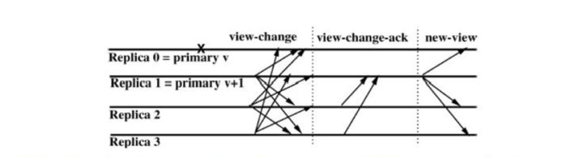

### 拜占庭将军问题
我们已知的共识算法，Paxos、Raft解决的都是非拜占庭问题，也就是可以容忍节点故障，消息丢失、延时等，但节点不能有恶意节点。但如何在有恶意节点存在的情况下达成共识呢？BFT共识算法就是解决这一问题的。即不但能容忍节点故障，还能容忍一定的恶意节点或者说拜占庭节点的存在。我们下面就学习一下BFT算法中的PBFT（Practical Byzantine Fault Tolerance）。BFT算法有非常多的变种，这里只学习PBFT，其他的可以举一反三。

### PBFT
PBFT核心由3个协议组成：一致性协议、检查点协议、视图更换协议。系统正常运行在一致性协议和检查点协议下，只有当主节点出错或者运行缓慢的情况下才会启动视图更换协议，以维持系统继续响应客户端的请求。下面详解这3个子协议。在讲一致性协议之前，我们屏蔽算法细节先看一下正常情况下大致是怎么工作的，大致流程如下：
1. 客户端发送请求给主节点（如果请求发送给了从节点，从节点会将该请求转发给主节点或者将主节点的信息告知客户端，让客户端发送给主节点）。
2. 主节点将请求广播给从节点。
3. 主从节点经过2轮投票后执行客户端的请求并响应客户端。（协议细节见下面的一致性协议）
4. 客户端收集到来着`f+1`个不同节点的相同的响应后，确认请求执行成功。（因为最多有`f`个恶意节点，`f+1`个相同即能保证正确性）。

#### 一致性协议
**一致性协议的目标是使来自客户端的请求在每个服务器上都按照一个确定的顺序执行。** 在协议中，一般有一个服务器被称作<u>主节点，负责将客户端的请求排序；其余的服务器称作从节点，按照主节点提供的顺序执行请求。</u>所有的服务器都在相同的配置信息下工作，这个配置信息称作视图view，每更换一次主节点，视图view就会随之变化。协议主要分`pre-prepare`、`prepare`、`commit`三阶段，如下图所示：

**REQUEST**: 
首先是客户端发起请求， 请求`<REQUEST,o,t,c>`中时间戳`t`主要用来保证`exactly-once`语义，也就是说对同一客户端请求不能有执行2次的情况，具体实现时也不一定非是时间戳，也可以是逻辑时钟或者其他，只要能唯一标识这个请求就可以了。

**PRE-PREPARE**: 
【1】 收到客户端的请求消息后，先判断当前正在处理的消息数量是否超出限制，如果超出限制，则先缓存起来，后面再打包一起处理。否则的话（当然，没超过也可以缓存处理），对请求分配序列号`n`，并附加视图号`v`等信息生成`PRE-PREPARE`消息`<<PRE-PREPARE,v,n,d>,m>`，广播给其他节点。简而言之就是对请求分配序号并告知所有节点。

【2】 收到`PRE-PREPARE`的消息后进行如下处理：
- 消息合法性检查，消息签名是否正确，消息摘要是否正确。
- 视图检查，检查是否是同一个视图号`v`。
- 水线检查，判断`n`是否在`h`和`H`之间。（`h`一般是系统稳定检查点，`H`是上限，会随着`h`的不断提高而提高）

如果都通过的话，就广播`PREPARE`消息`<PREPARE,v,n,d,i>`给其他节点，表示自己收到并认可`[n,v]`这个请求，进入prepare阶段。如果没有通过，则忽略该消息。

这里想一个问题，从节点能不能收到`PRE-PREPARE`消息就执行请求呢？答案显然是不能的，因为不能确认本节点与其他节点收到的是相同的请求消息，此时不能确定主节点是不是正常节点，如果主节点是恶意节点呢？比如，发送给从节点1的消息是`m`，而发送给从节点2的消息是`m'`，如果直接执行就会出现从节点的不一致。因为不能确认本节点与其他节点收到的是相同的请求消息，所以要通过从节点与从节点交互的方式互相告知收到了请求消息，好让后面阶段对比一下，是否一致。

**PREPARE**: 
收到`PREPARE`消息`<PREPARE,v,n,d,i>`后，进行如下处理：
- 消息合法性检查，消息签名是否正确，消息摘要是否正确。
- 视图检查，检查是否是同一个视图号`v`。
- 水线检查，判断`n`是否在`h`和`H`之间。

如果上面都通过，就将`PREPARE`消息加入到日志中，并继续收集`PREPARE`消息，如果收到正确的`2f`张（包括自己）`PREPARE`消息，这里如何验证是否正确呢？主要是收到的`PREPARE`要与`PRE-PREPARE`中的`v`、`n`、`d`等信息要匹配，就进入COMMIT阶段，广播`COMMIT`消息`<COMMIT,v,n,D(m),i>`。

这一阶段一般也可以称为第一轮投票，目的是什么呢？论文中是这么说的：<u>The pre-prepare and prepare phases of the algorithm guarantee that non-faulty replicas agree on a total order for the requests within a view. </u>浓缩为两个字就是定序，确定在同一视图下足额的正常的节点都对来自客户端的请求有相同的定序。再说的直白点，就是解决上面提到的，无法确认本节点与其他节点收到的消息是否一致的问题。通过检查相同视图号`v`及同一序号`n`下的消息摘要`d`是否一致来判断同一视图配置下的同一个序号请求的消息是否一致。同时也确保了有足够数量的节点收到了一致的消息请求。

可以再想一个问题，此时可以直接执行请求吗？答案是不可以，因为此时，你只能确认自己收到了`2f`个一致的`PREPARE`消息，你无法确认其他节点是否也收到了`2f`个一致的`PREPARE`消息。也就是说，当前，你只能确认自己准备好了去执行序号为`n`的请求，但是你不能确认其他节点有没有准备好，所以，还要再进行一次节点间的消息交互，互相告诉大家，我准备好了。

**COMMIT**:
在上一阶段，节点收到足额`PREPARE`投票后会广播`COMMIT`投票，过程类似，当节点收到其他节点的`COMMIT`投票消息后，会进行如下检查：
- 消息合法性检查，检查消息签名是否正确，消息摘要正不正确有没有被篡改。
- 视图检查，view是否匹配。
- 水线检查，判断`n`是否在`h`和`H`之间。                 

如果都通过则把收到的投票消息写入日志log中，如果收到的合法的`COMMIT`投票消息大于等于`2f+1`个（包括自己），意思就是，已经确认大多数节点都准备好了执行请求，就执行请求并回复`REPLY`消息给客户端。这里如同上面一样，也是检查视图，序号及消息是否匹配。

**REPLY**:
客户端收到`REPLY`后，会进行统计，如果收到`f+1`个相同时间戳`t`和响应值`r`，则认为请求响应成功。如果在规定的时间内没有收到回应或者没有收到足额回应怎么办？可以将该请求广播给所有节点，节点收到请求后，如果该请求已经被状态机执行了，则再次回复客户端`REPLY`消息，如果没有被状态机执行，如果节点不是主节点，就将该请求转发给主节点。如果主节点没有正常的将该请求广播给其他节点，则将会被怀疑是主节点故障或恶意节点，当有足够的节点都怀疑时将会触发视图变更协议，更换视图。

我们进行进一步的分析，可以看到，如果是客户端没有收到任何回应，很有可能是主节点故障或主节点是恶意节点（我就故意不执行你的请求），没有将请求足额广播给其他节点，（当然还有消息丢失等原因，这里不在详细分析），这时，客户端因一直没有响应，所以将请求广播给了所有节点，所有节点收到请求后，转发给主节点后发现主节点怎么什么都不干呀，怀疑主节点有问题，然后触发视图更换协议，换掉主节点。当然，客户端没有收到足额回应的一个原因还可能是消息丢失，那么如果是已经执行了该请求的节点再次收到该请求后会再次回应`REPLY`，前提是该请求是在水线范围内的合法请求，否则被拒绝。

#### 检查点协议
在上面的一致性协议中可以看到，系统每执行一个请求，服务器都需要记录日志（包括，request、pre-prepare、prepare、commit等消息）。如果日志得不到及时的清理，就会导致系统资源被大量的日志所占用，影响系统性能及可用性。另一方面，由于拜占庭节点的存在，一致性协议并不能保证每一台服务器都执行了相同的请求，所以，不同服务器状态可能不一致。例如，某些服务器可能由于网络延时导致从某个序号开始之后的请求都没有执行。因此，设置周期性的检查点协议，将系统中的服务器同步到某一个相同的状态。简言之，主要作用有2个：1、同步服务器的状态；2、定期清理日志。

同步服务器的状态，比较容易理解与做到。比如在区块链系统中，同步服务器的状态，实际上就是追块，即服务器节点会通过链定时广播的链世界状态或其他消息获知到自己区块落后了，然后启动追块流程。

定期清理日志，怎么做呢？首先要明确哪些日志可以被清理，哪些日志仍然需要保留。如果一个请求已经被`f+1`台非拜占庭节点执行，并且某一服务器节点`i`可以向其他服务器节点证明这一点，那么该`i`节点就可以将关于这个请求的日志删除。协议一般采用的方式是服务器节点每执行一定数量的请求就将自己的状态发送给所有服务器并且执行一个该协议，如果某台服务器节点收到`2f+1`台服务器节点的状态，那么其中一致的部分就是至少有`f+1`台非拜占庭服务器节点经历过的状态，因此，这部分的日志就可以删除，同时更新为较新状态。

具体实现时可以联想到上面的一致性协议总的水线检查。上面的低水线`h`值等同于稳定检查点，稳定检查点之前的日志都可被清理掉。高水线`H=h+k`，也就是接收请求序号上限值，因为稳定检查点往往是间隔很多的序号才触发一次，所以`k`一般要设置的足够大。例如，每间隔100个请求就触发一次检查点协议，提升水线，k可以设置为200。

>这里解释一下稳定检查点的概念，可以理解为当`2f+1`个节点都达到了某个请求序号，该请求序号就是稳定检查点。所有稳定检查点之前的消息都可以被丢弃，减少资源占用。 对比Raft，Raft是通过快照的方式压缩日志，都需要一个清理日志的机制，不然日志无限增长下去会造成系统不可用

#### 视图更换协议
在一致性协议里，已经知道主节点在整个系统中拥有序号分配，请求转发等核心能力，支配着这个系统的运行行为。然而一旦主节点自身发生错误，就可能导致从节点接收到具有相同序号的不同请求，或者同一个请求被分配多个序号等问题，这将直接导致请求不能被正确执行。视图更换协议的作用就是在主节点不能继续履行职责时，将其用一个从节点替换掉，并且保证已经被非拜占庭服务器执行的请求不会被篡改。即，核心有2点：1，主节点故障时，可能造成系统不可用，要更换主节点；2，当主节点是恶意节点时，要更换为诚实节点，不能让作恶节点作为主节点。

当检测到主节点故障或为恶意节点触发视图更换时，下一任主节点应该选谁呢？PBFT的办法是采用“轮流上岗”的方式，通过`(v+1) mod N`，其中`v`为当前视图号，`N`为节点总数，通过这一方式确定下一个视图的主节点。还有个更关键的问题，什么时候触发视图更换协议呢？我们继续往下讨论。

如果是主节点故障的情况，这种情况一般较好处理。具体实现时，一般从节点都会维护一个定时器，如果长时间没有收到来自主节点的消息，就会认为主节点发生故障。此时可触发视图更换协议，当然具体实现时，细节可能会不同，比如，也可以是这种情况，客户端发送请求给故障主节点必然导致长时间收不到响应，所以，客户端将请求发送给了系统中所有从节点，从节点将请求转发给主节点并启动定时器，如果主节点长时间没有将该请求分配序号发送`PRE-PREPARE`消息，认为主节点故障，触发视图更换协议。这2种情况比较好理解，但就这2种情况吗？其实还有以下几种情况也会触发视图更换协议：
- 从节点广播`PREPARE`消息后，在约定的时间内未收到来自其他节点的`2f`个一致合法消息。
- 从节点广播`COMMIT`消息后，在约定的时间内未收到来自其他节点的`2f`个一致合法消息。
- 从节点收到异常消息，比如视图、序号一致，但消息不一致。
这三点，都有可能是主节点作恶导致的，但也有可能是消息丢失等原因导致的。虽然不一定是因为主节点异常导致的，但从另一个角度看，解决了从节点不能无限等待其他节点投票消息的问题。

>这里补充一点，触发视图更换协议后，将不再接收除检查点消息、`VIEW-CHANGE`消息、`NEW-VIEW`消息之外的消息。也就是视图更换期间，不再接收客户端请求，暂停服务。

解决了什么时候触发的问题后，下一个问题就是具体怎么实现呢？当因上面的情况触发视图更换协议时，从节点`i`就会广播一个`VIEW-CHANGE`消息`<VIEW-CHANGE,v+1,n,C,P,i>`，序号`n`是节点`i`的最新稳定检查点`s`，`C`是`2f+1`个有效检查点消息，是为了证明稳定检查点`s`的正确性，`P`是位于序号`n`之后的一系列消息的结合，这里要包含这些信息可以理解为是证据，也就是说，从节点不能随便就发送一个`VIEW-CHANGE`，什么证据都没有，别人怎么能认同你更换视图呢？。上面我们提到过下一任主节点是谁的问题？通过`(v+1) mod N`确定的一下任主节点`p`(在图中就是节点1)，在收到`2f`个有效的`VIEW-CHANGE`消息后，就广播`<NEW-VIEW,v+1,V,O>`消息，这里`V`和`O`具体的生成方法参考原论文，主要是`VIEW-CHANGE`和`PRE-PREPARE`等消息构成的集合，主要目的是为了让从节点去验证当前新的主节点的合法性以及解决下面这个问题，还有要处理未确认消息和投票消息。

视图更换协议需要解决的问题是如何保证已经被非拜占庭服务器执行的请求不被更改。由于系统达成一致性之后至少有`f+1`台非拜占庭服务器节点执行了请求，所以目前采用的方法是：由新的主节点收集至少`2f+1`台服务器节点的状态信息（也就是上面在构造消息时所需的各种消息集合），这些状态信息中一定包含所有执行过的请求；然后，新主节点将这些状态信息发送给所有的服务器，服务器按照相同的原则将在上一个主节点完成的请求同步一遍，同步之后，所有的节点都处于相同的状态，这时就可以开始执行新的请求。

### 若干细节问题的思考
#### 在3阶段协议中，对收到的消息都要进行消息合法性检查、视图检查、水线检查这3项检查，为什么呢？
这3项检查是十分有必要的，添加消息签名是为了验证投票是否合法，正确统计合法票数，不能是随便一个不知道的节点都能投票，那我怎么验证到底是谁投的呀。也就是说，要通过消息签名的方式确认消息来源，通过消息摘要的方式，确认消息没有被篡改。当然，考虑到性能因素，也可以使用消息认证码（MAC），以节省大量加解密的性能开销。PBFT算法，可以容忍节点作恶，消息丢失、延时、乱序，但消息不能被篡改。

视图检查比较容易理解，所有节点必须在同一个配置下才能正常工作。如果节点的视图配置不一致，比如主节点不一致、节点数量不一致，那统计合法票数的时候，真没法干了。

水线检查，是检查点协议的一部分，在工程实现时，不是所有的请求我都有处理，比如，你收到一个历史投票信息，你还有必要处理吗？当然，它的作用不止于此，还可以防止恶意节点选择一个非常大的序列号而耗尽序列号空间，例如，当一个节点分配了超过`H`上限的序列号，这时，正常节点会拒绝这个请求从而阻止了恶意节点分配的远超过`H`的序列号。

#### 3阶段协议中每一阶段的意义是什么？
论文中有如下表述：
>The three phases are pre-prepare, prepare, and commit.<u>The pre-prepare and prepare phases are used to totally order requests sent in the same view </u> even when the primary, which proposes the ordering of requests, is faulty. <u>The prepare and commit phases are used to ensure that requests that commit are totally ordered across views.</u>

即，`pre-prepare`和`prepare`阶段，主要的作用就是定序，个人理解就是要确认有足够数量的节点收到同一请求，并且与自己所收到的请求相一致。`prepare`以及`commit`阶段是确认大家执行的同一请求。

#### 为什么是3f+1？
我们知道PBFT的容错能力为不超过三分之一，即`n=3f+1`，`f`为拜占庭节点数量。但这个公式是怎么来的呢？论文中有这么一段论述可以帮助我们去理解：
>The resiliency of our algorithm is optimal: `3f+1` is the minimum number of replicas that allow an asynchronous system to provide the safety and liveness properties when up to `f` replicas are faulty. This many replicas are needed because it must be possible to proceed after communicating with `n-f` replicas, since `f` replicas might be faulty and not responding. However, it is possible that the `f` replicas that did not respond are not faulty and, therefore, `f` of those that responded might be faulty. Even so, there must still be enough responses that those from non-faulty replicas outnumber those from faulty ones, i.e., `n-2f>f`. Therefore `n>3f`.

意思就是，在一个容忍`f`个错误节点的系统中，系统至少要`3f+1`个节点才能保证系统安全可靠。为什么呢？因为在所有`n`个节点中，有`f`个节点可能因故障而没有回应（或者投票），而在回应的`n-f`中又有可能有`f`个是恶意节点的回应，即使如此，也要保证正常节点的投票要多于恶意节点的投票数量，即`n-f-f>f`，推出`n>3f`

#### PBFT对比Raft
PBFT对比Raft，最大的不同在于解决的问题不一样，虽然都是共识算法，但一个解决的拜占庭问题，另一个则解决的非拜占庭问题。从算法细节上来看，Raft中的领导者是强领导者，即，一切领导者说了算，但PBFT中对应的主节点却不是，因为不能保证主节点不是拜占庭节点，万一主节点作恶，从节点要有发现主节点是恶意节点的能力，并及时触发视图更换协议更换主节点。从算法消耗的资源来看，明显PBFT要更复杂，投票数明显多于Raft，不但要主从节点交互，还有从节点与从节点互相交互，所以，其性能也一定比Raft低，这是肯定的，因为PBFT解决的问题比Raft更复杂，一定程度上可以认为Raft是PBFT的子集，如果你把PBFT三阶段协议中从节点与从节点交互的那部分去掉，只保留主节点与从节点交互的那部分，你会发现，好像还蛮像的。从另一个方面说，Raft算法，因为没有拜占庭节点的存在，领导者节点一定是对的，从节点一切听领导的就是。但是在PBFT中，从节点就不能光听主节点的，万一主节点也是坏人咋办？怎么解决这个问题呢？显然，只听主节点肯定是不行的，我还要看看其他节点的意见，如果有足额的节点认为是对的，就同意。怎么确定足额节点数到底是多少呢？上面有讲到过。所以，相比Raft，PBFT多了从节点与从节点的消息交互。

#### PBFT的时间复杂度分析
PBFT有比较明显的两轮投票，所以时间复杂度`O(n^2)`，节点数量较大时，一次共识协商所需的消息太多，这也决定了PBFT只能适用于节点数量不大的系统中，比如区块链中的许可链，公链节点数量太多，并不适用PBFT算法。