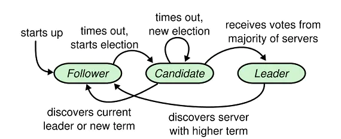
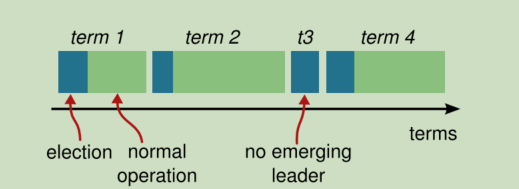
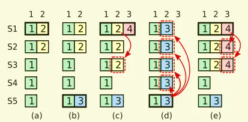
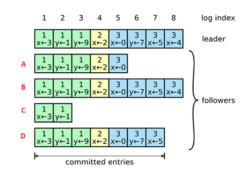
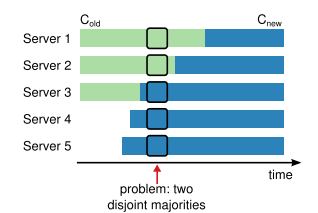
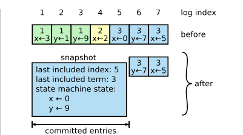
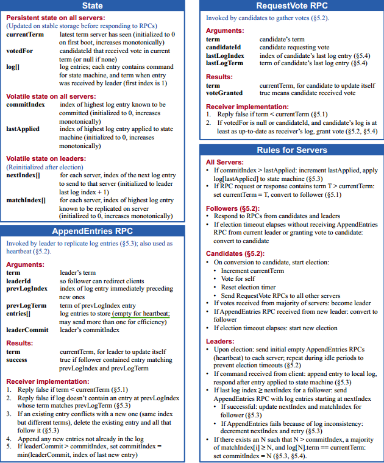

Raft共识算法在分布式系统中是常用的共识算法之一，论文原文[In Search of an Understandable Consensus Algorithm](https://raft.github.io/raft.pdf) ，作者在论文中指出Poxas共识算法的两大问题，其一是难懂，其二是应用到实际系统存在困难。针对Paxos存在的问题，作者的目的是提出一个易懂的共识算法，论文中有单独一小节论述Raft是一个实用的、安全可用、有效易懂的共识算法。本文描述了Raft共识算法的细节，很多内容描述及引用图片均摘自论文原文。

### Raft概述
我们主要分以下三部分对Raft进行讨论：
- Leader election——a new leader must be chosen when
an existing leader fails. （领导人选举）
- Log replication——the leader must accept log entries from clients and replicate them across the cluster,
forcing the other logs to agree with its own.（日志复制）
- Safety——the key safety property for Raft. （安全性）

正常工作过程中，Raft分为两部分，首先是leader选举过程，然后在选举出来的leader基础上进行正常操作，比如日志复制操作等。

一个Raft集群通常包含$2N+1$个服务器，允许系统有$N$个故障服务器。每个服务器处于3个状态之一：`leader`、`follower`或`candidate`。正常操作状态下，仅有一个leader，其他的服务器均为follower。follower是被动的，不会对自身发出的请求而是对来自leader和candidate的请求做出响应。leader处理所有的client请求（若client联系follower，则该follower将转发给leader)。candidate状态用来选举leader。状态转换如下图所示：

为了进行领导人选举和日志复制等，需要服务器节点存储如下状态信息：

|状态|所有服务器上持久存在的|
|-------|------|
|currentTerm | 服务器最后一次知道的任期号（初始化为 0，持续递增）|
|votedFor | 在当前获得选票的候选人的 Id|
| log[] | 日志条目集；每一个条目包含一个用户状态机执行的指令，和收到时的任期号 |

|状态|所有服务器上经常变的|
|-------|------|
| commitIndex| 已知的最大的已经被提交的日志条目的索引值|
| lastApplied| 最后被应用到状态机的日志条目索引值（初始化为 0，持续递增）|

| 状态 | 在领导人里经常改变的 （选举后重新初始化）|
|----|--------|
| nextIndex[] | 对于每一个服务器，需要发送给他的下一个日志条目的索引值（初始化为领导人最后索引值加一）|
| matchIndex[] | 对于每一个服务器，已经复制给他的日志的最高索引值|

Raft在任何时刻都满足如下特性：
- Election Safety：在一个任期中只能有一个leader；
- Leader Append-Only：leader不会覆盖或删除日志中的entry，只有添加entry（follower存在依据leader回滚日志的情况）；
- Log Matching：如果两个日志包含了一条具有相同index和term的entry，那么这两个日志在这个index之前的所有entry都相同；（可以思考一下这个是怎么保证的呢？由后面讲到的一致性检查来保证，即follower节点接收到日志复制请求后要进行一致性检查,其证明过程有点类似于数学归纳法）
- <u>Leader Completeness： 如果在某一任期一条entry被提交committed了，那么在更高任期的leader中这条entry一定存在；</u>  （领导人选举时会保证这一性质，后面会讲到这个问题）
- State Machine Safety：如果一个节点将一条entry应用到状态机中，那么任何节点也不会再次将该index的entry应用到状态机里；

下面我们详细讨论这几部分。
### Leader选举
一个节点初始状态为follower，当follower在选举超时时间内未收到leader的心跳消息，则转换为candidate状态。为了避免选举冲突，这个超时时间是一个随机数（一般为150~300ms）。超时成为candidate后，向其他节点发出`RequestVote`RPC请求，假设有$2N+1$个节点，收到$N+1$个节点以上的同意回应，即被选举为leader节点，开始下一阶段的工作。如果在选举期间接收到eader发来的心跳信息，则candidate转为follower状态。
>在选举期间，可能会出现多个candidate的情况，可能在一轮选举过程中都没有收到多数的同意票，此时再次随机超时，进入第二轮选举过程，直至选出leader或着重新收到leader心跳信息，转为follower状态。

正常状态下，leader会不断的广播心跳信息，follower收到leader的心跳信息后会重置超时。当leader崩溃或者出现异常离线，此时网络中follower节点接收不到心跳信息，超时再次进入选举流程，选举出一个leader。

>这里还有补充一些细节，每个leader可以理解为都是有自己的任期(term)的，每一期起始于选举阶段，直到因节点失效等原因任期结束。每一期选举期间，每个follower节点只能投票一次。图中`t3`可能是因为没有获得超半数票等造成选举失败，须进行下一轮选举，此时follower可以再次对最先到达的candidate发出的`RequestVote`请求投票（先到先得）。

对所有的请求（RequestVote、AppendEntry等请求），如果发现其Term小于当前节点，则拒绝请求，如果是candidate选举期间，收到不小于当前节点任期的leader节点发来的`AppendEntry`请求，则认可该leader，candidate转换为follower。这里还有一些细节，follower节点怎么判断我是否投票给candidate节点呢？或者说，选举领导人应该有怎样的原则呢？如何选举才能保证满足上面提到过的第4条性质？后面会讲到这个问题。

### 日志复制（Log replication）
前面leader选举的过程，leader选举成功后，将进入有效工作阶段，即日志复制阶段，其中日志复制过程会分记录日志和提交数据两个阶段。

整个过程如下：
1. 首先client向leader发出command指令；（每一次command指令都可以认为是一个entry，或者说是日志项）
2. leader收到client的command指令后，将这个command entry追加到本地日志中，此时这个command是uncommitted状态，因此并没有更新节点的当前状态；
3. 之后，leader向所有follower发送这条entry，也就是通过日志复制AppendEntries消息 *(可以是一条也可以是多条日志项)* 将日志项复制到集群其他节点上，follower接收到后 *（这里有判断条件的，并不是所有leader发送来的日志项都无条件接收，而且还可能存在本地与leader日志不一致的情况，后面会详细说明，这里先看正常情况）* 追加到本地日志中，并回应leader成功或者失败；
4. leader收到大多数follower的确认回应后，此entry在leader节点由uncommitted变为committed状态，此时按这条command更新leader状态，或者说将该日志项应用到状态机，然后向client返回执行结果；
5. 在下一心跳中(这里也可以是或者说多数情况下是新的日志复制AppendEntries消息，会带有相关信息，后面后详细的字段说明会讲到)，leader会通知所有follower更新确认的entry，follower收到后，更新状态，这样，所有节点都完成client指定command的状态更新。

可以看到client每次提交command指令，服务节点都先将该指令entry追加记录到日志中，等leader确认大多数节点已追加记录此条日志后，在进行提交确认，更新节点状态。如果还对这个过程有些模糊的话，可以参考[Raft动画演示](http://thesecretlivesofdata.com/raft/)，较为直观的演示了领导人选举及日志复制的过程。这里讲到的都是正常情况下的运行过程。

实际上，还有很多问题，还需要考虑follower与leader日志不匹配或者不一致时怎么办？旧的leader挂掉了之后，新的leader怎么处理？成员怎么变更，或者说怎么添加成员？出现网络分区时会发生什么？网络分区恢复后，怎么处理状态不一致的情况？具体工程实现时，日志可能会面临无限增长的情况，有什么解决办法呢？我们下面就分析一下raft是怎么解决这些问题的。       

### 安全（Safety）
前面描述了Raft算法是如何选举和复制日志的。然而，到目前为止描述的机制并不能充分的保证每一个状态机会按照相同的顺序执行相同的指令。我们需要再继续深入思考以下几个问题：
- 第一个问题，leader选举时follower收到candidate发起的投票请求，如果同意就进行回应，但具体的规则是什么呢？是所有的follower都有可能被选举为领导人吗？
- 第二个问题，leader可能在任何时刻挂掉，新任期的leader怎么提交之前任期的日志条目呢？

#### 选举限制
针对第一个问题，之前并没有细讲，如果当前leader节点挂了，需要重新选举一个新leader，此时follower节点的状态可能是不同的，有的follower可能状态与刚刚挂掉的leader相同，状态较新，有的follower可能记录的当前index比原leader节点的少很多，状态更新相对滞后，此时，从系统最优的角度看，选状态最新的candidate为佳，从正确性的角度看，要确保Leader Completeness，即如果在某一任期一条entry被提交成功了，那么在更高任期的leader中这条entry一定存在，反过来讲就是如果一个candidate的状态旧于目前被committed的状态，它一定不能被选为leader。具体到投票规则：     
1） 节点只投给拥有不比自己日志状态旧的节点；        
2）每个节点在一个term内只能投一次，在满足1的条件下，先到先得；      

我们看一下**请求投票 RPC**（由候选人负责调用用来征集选票）的定义：
| 参数 | 解释|
|---|---|
|term| 候选人的任期号|
|candidateId| 请求选票的候选人的 Id |
|lastLogIndex| 候选人的最后日志条目的索引值|
|lastLogTerm| 候选人最后日志条目的任期号|

| 返回值| 解释|
|---|---|
|term| 当前任期号，以便于候选人去更新自己的任期号|
|voteGranted| 候选人赢得了此张选票时为真|

接收者实现：        
1. 如果`term < currentTerm`返回 false 
2. 如果 votedFor 为空或者为 candidateId，并且候选人的日志至少和自己一样新，那么就投票给他

可以看到RequestVote投票请求中包含了lastLogIndex和lastLogTerm用于比较日志状态。这样，虽然不能保证最新状态的candidate成为leader，但能够保证被选为leader的节点一定拥有最新被committed的状态，但不能保证拥有最新uncommitted状态entries。

#### 提交之前任期的日志条目
领导人知道一条当前任期内的日志记录是可以被提交的，只要它被存储到了大多数的服务器上。但是之前任期的未提交的日志条目，即使已经被存储到大多数节点上，也依然有可能会被后续任期的领导人覆盖掉。下图说明了这种情况：

> 如图的时间序列展示了为什么领导人无法决定对老任期号的日志条目进行提交。在 (a) 中，S1 是领导者，部分的复制了索引位置 2 的日志条目。在 (b) 中，S1崩溃了，然后S5在任期3里通过S3、S4和自己的选票赢得选举，然后从客户端接收了一条不一样的日志条目放在了索引 2 处。然后到 (c)，S5又崩溃了；S1重新启动，选举成功，开始复制日志。在这时，来自任期2的那条日志已经被复制到了集群中的大多数机器上，但是还没有被提交。如果S1在(d)中又崩溃了，S5可以重新被选举成功（通过来自S2，S3和S4的选票），然后覆盖了他们在索引 2 处的日志。反之，如果在崩溃之前，S1 把自己主导的新任期里产生的日志条目复制到了大多数机器上，就如 (e) 中那样，那么在后面任期里面这些新的日志条目就会被提交（因为S5 就不可能选举成功）。 这样在同一时刻就同时保证了，之前的所有老的日志条目就会被提交。

为了消除上图里描述的情况，Raft永远不会通过计算副本数目的方式去提交一个之前任期内的日志条目。只有领导人当前任期里的日志条目通过计算副本数目可以被提交；一旦当前任期的日志条目以这种方式被提交，那么由于日志匹配特性，之前的日志条目也都会被间接的提交。

>当领导人复制之前任期里的日志时，Raft 会为所有日志保留原始的任期号。 

### 对Raft中几种情况的思考
#### follower节点与leader日志内容不一致时怎么处理？

我们先举例说明：正常情况下，follower节点应该向B节点一样与leader节点日志内容一致，但也会出现A、C等情况，出现了不一致，以A、B节点为例，当leader节点向follower节点发送AppendEntries`<prevLogIndex=7,prevLogTerm=3,entries=[x<-4]>,leaderCommit=7`时，我们分析一下发生了什么，B节点日志与`prevLogIndex=7,prevLogTerm=3`相匹配，将`index=7`（`x<-5`）这条entry提交committed，并在日志中新加入entry`x<-4`，处于uncommitted状态；A节点接收到时，当前日志`index<prevLogIndex`与`prevLogIndex=7,prevLogTerm=3`不相匹配，拒接该请求返回false，不会将`x<-4`添加到日志中，当leader知道A节点因日志不一致拒接了该请求后，不断递减`preLogIndex`重新发送请求，直到A节点`index,term`与`prevLogIndex,prevLogTerm`相匹配，将leader的entries复制到A节点中，达成日志状态一致。

我们看一下**附加日志AppendEntries RPC**（由领导人负责调用复制日志指令；也会用作heartbeat）的定义：
| 参数 | 解释 |
|----|----|
|term| 领导人的任期号|
|leaderId| 领导人的 Id，以便于跟随者重定向请求|
|prevLogIndex|新的日志条目紧随之前的索引值|
|prevLogTerm|prevLogIndex 条目的任期号|
|entries[]|准备存储的日志条目（表示心跳时为空；一次性发送多个是为了提高效率）|
|leaderCommit|领导人已经提交的日志的索引值|

| 返回值| 解释|
|---|---|
|term|当前的任期号，用于领导人去更新自己|
|success|跟随者包含了匹配上 prevLogIndex 和 prevLogTerm 的日志时为真|

接收者实现：    
1. 如果 `term < currentTerm` 就返回 false；         
2. 如果日志在 prevLogIndex 位置处的日志条目的任期号和 prevLogTerm 不匹配，则返回 false；
3. 如果已经存在的日志条目和新的产生冲突（索引值相同但是任期号不同），删除这一条和之后所有的；（raft中follower处理不一致的一个原则就是一切听从leader）
4. 附加日志中尚未存在的任何新条目；
5. 如果 `leaderCommit > commitIndex`，令 commitIndex 等于 leaderCommit 和 新日志条目索引值中较小的一个；

简单总结一下，出现不一致时核心的处理原则是一切遵从leader。当leader向follower发送AppendEntry请求，follower对AppendEntry进行一致性检查，如果通过，则更新状态信息，如果发现不一致，则拒绝请求，leader发现follower拒绝请求，出现了不一致，此时将递减nextIndex，并重新给该follower节点发送日志复制请求，直到找到日志一致的地方为止。然后把follower节点的日志覆盖为leader节点的日志内容。

#### leader挂掉了，怎么处理？
前面可能断断续续的提到这种情况的处理方法，首要的就是选出新leader，选出新leader后，可能上一任期还有一些entries并没有提交，处于uncommitted状态，该怎么办呢？处理方法是新leader只处理提交新任期的entries，上一任期未提交的entries，如果在新leader选举前已经被大多数节点记录在日志中，则新leader在提交最新entry时，之前处于未提交状态的entries也被committed了，因为如果两个日志包含了一条具有相同index和term的entry，那么这两个日志在这个index之前的所有entry都相同；如果在新leader选举前没有被大多数节点记录在日志中，则原有未提交的entries有可能被新leader的entries覆盖掉，这个问题前面已经讲过。

#### 出现网络分区时怎么处理？
分布式系统中网络分区的情况基本无法避免，出现网络分区时，原有leader在分区的一侧，此时如果客户端发来指令，旧leader依旧在分区一测进行日志复制的过程，但因收不到大多数节点的确认，客户端所提交的指令entry只能记录在日志中，无法进行提交确认，处于uncommitted状态。而在分区的另一侧，此时收不到心跳信息，会进入选举流程重新选举一个leader，新leader负责分区零一侧的请求，进行日志复制等操作。因为新leader可以收到大多数follower确认，客户端的指令entry可以被提交，并更新节点状态，当网络分区恢复时，此时两个`leader`会收到彼此广播的心跳信息，此时，旧leader发现更大term的leader，旧leader转为follower，此时旧leader分区一侧的所有操作都要回滚，接受新leader的更新。

#### 成员变更问题，如何添加成员？
在分布式系统中，节点数量或者说服务器数量不是一成不变的，我们有可能会随时增减节点数量，当增加节点时，有可能会出现两个leader选举成功的情况，主要是新旧配置不一致造成的，怎么处理呢？最简单粗暴的就是把目前所有节点都停掉，更新配置，再重启所有节点，但会造成一段时间服务不可用，很多情况下这是不能被允许的。raft的解决办法原论文中是联合共识（Joint Consensus）的办法，后来又提出了单节点变更（single-server changes）的方法。我们下面详细描述一下这个问题。

Raft要求，在任一任期内，只能有一个leader，而成员变更的麻烦就在于，成员变更时可能会出现两个leader，以一个例子说明：原系统有3个节点，成员为[1,2,3]，现新增成员**4、5**。假设在成员变更时，1、2与3发生分区，此时，[1,2]为一组，1通过1、2两节点选举为leader，而5通过3、4、5选举为leader，就形成了2个leader并存的情况。

因为每个节点新旧配置更新的时间不同，造成了在某一时刻，可能会存在新旧配置的两个大多数情况的存在，上图中，旧配置的大多数是两个节点，而新配置的大多数是三个节点，在图中红线头的时刻存在两个大多数的情况，如果此时出现网络分区进行选举时就会出现两个leader的情况。

怎么解决呢？用什么办法才能不让上面两个大多少情况的出现呢？可通过单节点变更解决，即通过一次变更一个节点实现成员变更。主要思想是利用“一次变更一个节点，不会同时存在旧配置和新配置的两个大多数”的特性，实现成员变更。比如上面的情况，就可先将3节点集群[A,B,C]变更为4节点集群[A,B,C,D]，再将4节点集群变更为5节点集群[A,B,C,D]。
>为什么单节点变更不会造成两个大多数情况的出现呢？我们可以进行如下推理：假设原节点数为`2n+1`，则旧配置的大多数`major_old=n+1`，新加入1个节点，新配置节点数为`2n+2`，则新配置的大多数为`major_new=n+2`，同时存在两个大多数所需节点数目为`major=major_old+major_new=n+1+n+2=2n+3>2n+2`，也就是两个大多数所需节点数超出了节点总数，故不存在这种情况，如何是删除成员，其推理过程类似，结论相同。

具体的，我们依旧以这个3节点集群变更为5节点集群为例进行说明。假设现3节点集群[A,B,C]，节点A为leader，配置为[A,B,C]，我们先向集群加入节点D,新的配置为[A,B,C,D]，成员变更通过以下两步实现：
- 第一步，leader节点A向新节点D同步数据；
- 第二步，leader将新配置[A,B,C,D]作为一个日志项复制到新配置中的所有节点（A,B,C,D）上，然后将新配置的日志项应用到本地状态机，完成单节点变更。                    

在变更后，现有集群的配置项就是[A,B,C,D]，添加E节点也是同样的步骤。上面的描述如果理解的比较模糊的话，其实raft是采用将修改集群配置的命令放在日志条目中来处理的，其修改配置项，就是一条日志项，其流程与普通的日志项相同，只不过最后状态机执行的结果是配置变更。

### 日志压缩
日志压缩主要是为了解决无限增长的日志与有限的存贮空间的矛盾，可以想一个问题：对于已经committed的日志项，是否有必要一直保存下去？如果没有必要的话，是否可以对部分已committed的日志项删减或压缩呢？raft的主要的解决办法是采用快照进行日志压缩。

如上图所示，对于日志索引5之前的日志项可以删除，只保留一个快照（保存有当前状态以及一些任期索引号等元信息）即可。

具体工程实现时，一般每个节点独立打快照，当日志超过一定量会触发快照操作，具体实现以及更多细节待以后深究。

### Client Protocol
raft共识算法真正工作时还需有一个客户端协议（client protocol），综合解决一些列的问题。比如会遇到下面这些问题：client怎么和集群交互呢？client如果知道leader节点的话，可以直接将command发给leader节点，如果不知道的话，可以随意发给集群中已知的节点，节点会将client的请求转给leader。其实上面还有个问题，client发送请求（或者command）给leader,但是leader迟迟不给回应怎么办？重试是一个办法。连接的leader崩溃了client怎么办？如果client超时重发command，怎么保证command不被状态机执行两次？client生成command的时候要给加上唯一ID，当server的日志中已存在相同command时会忽略。

### 附录
这里附加一张论文中的截图，里面详细讲明了不同节点需要维护什么信息，每个消息是怎么定义的，以及消息该如何处理等，不包含日志压缩以及成员变更部分：

这里补充一点，raft共识算法与pbft共识算法解决的是不同的问题，即raft节点不能存在恶意节点，节点消息可以延迟、丢失，但不能造假或作恶，即不能存在拜占庭节点。

本文对raft共识算法做了一个整体的梳理学习，可能会存在某些细节描述不清晰的地方，在真正工程代码实现时，还会存在更多的细节问题，同时，这里缺少证明为什么raft算法是正确的证明，有待今后更深一步理解共识算法后再行补充。

---
>参考文档：     
[In Search of an Understandable Consensus Algorithm](https://raft.github.io/raft.pdf)     
[raft论文中文翻译](https://github.com/maemual/raft-zh_cn/blob/master/raft-zh_cn.md)