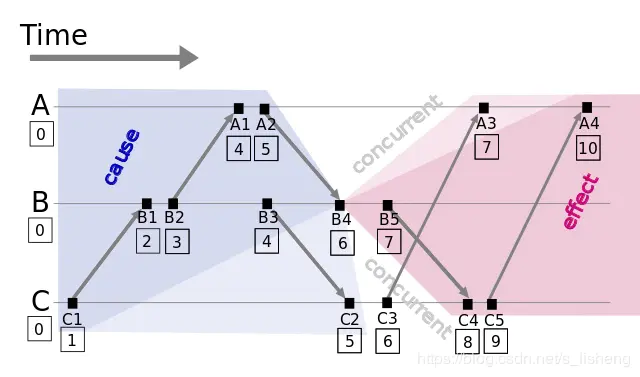
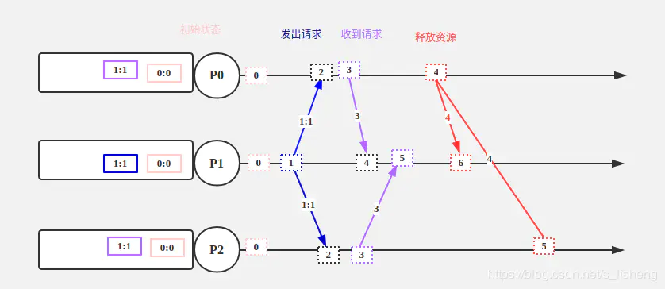

在程序中，我们经常需要知道事件序列，在单体应用中，事件序列是较为简单的，最简单的办法就是用时间戳，但在分布式系统中，事件序列是很困难的，[Leslie Lamport](https://en.wikipedia.org/wiki/Leslie_Lamport)大神在论文[Time, Clocks, and the Ordering of Events in a Distributed System](http://lamport.azurewebsites.net/pubs/time-clocks.pdf)讨论了在分布式系统中时间、时钟和事件序列的问题。

#### 【1】分布式系统中物理时钟存在的问题
逻辑时钟是相对物理时钟这个概念的，为什么要提出逻辑时钟，因为物理时钟在分布式系统中存在一系列问题。在一台机器上的多个进程可以从一个物理时钟中获取时间戳，不管这个物理时钟是否准确，只要是从一个物理时钟获取时间戳，我们都能获得多个事件的相对时间顺序。但是在分布式系统中，我们无法从一个物理时钟获取时间戳，只能从各自机器上物理时钟获取时间戳，而各台机器的物理时钟是很难完全同步的，即使有NTP，精度也是有限的。所以在分布式系统中，是不能通过物理时钟决定事件序列的。

>物理时钟在分布式系统中也不是毫无用处，至少它一定程度上可以判断在一台机器上的事件顺序，同时分布式系统中还是有必要让不同机器上的物理时钟在一定精度内同步时间的，只是不作为决定事件序列的方法。

#### 【2】偏序（Partial Ordering）
事件序列有两种：偏序事件序列和全序事件序列。所谓的偏序指的是只能为系统中的部分事件定义先后顺序。这里的部分其实是有因果关系的事件。在论文[Time, Clocks, and the Ordering of Events in a Distributed System](http://lamport.azurewebsites.net/pubs/time-clocks.pdf)中，偏序是由“happened before”引出的，我们先看一下"happened before"（表示为“`->`”）的定义：

Definition. The relation "`->`"on the set of events of a system is the smallest relation satisfying the following three conditions:   
(1) If `a` and `b` are events in the same process, and `a` comes before `b`, then `a->b`.   
(2) If `a` is the sending of a message by one process and `b` is the receipt of the same message by another process, then `a->b`.    
(3) If `a->b` and `b->c` then `a->c`. 

在分布式系统中，只有两个发生关联的事件（有因果关系），我们才会去关心两者的先来后到关系。对于并发事件，他们两个谁先发生，谁后发生，其实我们并不关心。偏序就是用来定义两个因果事件的发生次序，即‘happens before’。而对于并发事件（没有因果关系），并不能决定其先后，所以说这种‘happens before’的关系，是一种偏序关系。
>If two entities do not exchange any messages, then they probably do not need to share a common clock; events occurring on those entities are termed as concurrent events.”

#### 【3】逻辑时钟
论文原文中有这样一句：***We begin with an abstract point of view in which a clock is just a way of assigning a number to an event, where the number is thought of as the time at which the event occurred.*** 这句话的意思是，可以把时间进行抽象，把时间值看成是事件发生顺序的一个序列号，这个值可以`<20190515,20190516,20190517>`，也可以是`<1,2,3>`。后面就有了逻辑时钟的概念。定义如下：      
we define `a` clock `Ci` for each process `Pi` to be a function which assigns a number `Ci(a)` to any event `a` in that process.

Clock Condition. For any events `a,b`: if `a->b` then `C(a) < C(b)`.       
C1. If `a` and `b` are events in process `Pi`, and `a` comes before `b`, then `Ci(a) < Ci(b)`.     
C2. If `a` is the sending of a message by process `Pi` and `b` is the receipt of that message by process `Pi`, then `Ci(a) < Ci(b)`.

具体的，根据上面的定义条件，我们做如下实现规则：    
- 每个事件对应一个Lamport时间戳，初始值为0      
- 如果事件在节点内发生，本地进程中的时间戳加1       
- 如果事件属于发送事件，本地进程中的时间戳加1并在消息中带上该时间戳     
- 如果事件属于接收事件，本地进程中的时间戳 = Max(本地时间戳，消息中的时间戳) + 1    

根据上面的定义，我们知道`a->b`，`C(a)<C(b)`，但如果`C(a)=C(b)`，那么`a,b`是什么顺序呢？它们肯定不是因果关系，所以它们之间的先后其实并不会影响结果，我们这里只需要给出一种确定的方式来定义它们之间的先后就能得到全序关系。

一种可行的方式是利用给进程编号，利用进程编号的大小来排序。假设`a、b`分别在节点`P、Q`上发生，`Pi、Qj`分别表示我们给`P、Q`的编号，如果 `C(a)=C(b)` 并且 `Pi<Qj`，同样定义为`a`发生在`b`之前，记作 `a⇒b`（全序关系）。假如我们上图的`A、B、C`分别编号`Ai=1、Bj=2、Ck=3`，因 `C(B4)=C(C3)` 并且 `Bj<Ck`，则 `B4⇒C3`。

通过以上定义，我们可以对所有事件排序，获得事件的全序关系(total order)。上图例子，我们可以进行排序：`C1⇒B1⇒B2⇒A1⇒B3⇒A2⇒C2⇒B4⇒C3⇒A3⇒B5⇒C4⇒C5⇒A4`。观察上面的全序关系你可以发现，从时间轴来看`B5`是早于`A3`发生的，但是在全序关系里面我们根据上面的定义给出的却是`A3`早于`B5`，这是因为Lamport逻辑时钟只保证因果关系（偏序）的正确性，不保证绝对时序的正确性。

#### 【4】尝试用逻辑时钟解决分布式锁的问题
单机多进程程序可由锁进行同步，那是因为这些进程都运行在操作系统上，有center为它们的请求排序，这个center知道所有需要进行同步的进程的所有信息。但是在分布式系统中，各个进程运行在各自的主机上，没有一个center的概念，那分布式系统中多进程该怎么进行同步呢？或者说分布式锁该怎么实现呢？论文中提出了解决这一问题的算法要满足下面三个条件：      
 (I) A process which has been granted the resource must release it before it can be granted to another process.     
 (II) Different requests for the resource must be granted in the order in which they are made.  
 (III) If every process which is granted the resource eventually releases it, then every request is eventually granted.      
为了简化问题，我们做如下假设：
- 任何两个进程`Pi`，`Pj`它们之间接收到的消息的顺序与发送消息的顺序一致，并且每个消息一定能够被接收到。
- 每个进程都维护一个不被其他进程所知的请求队列。并且请求队列初始化为包含一个`T0:P0`请求，`P0`用于该共享资源，`T0`是初始值小于任何时钟值

算法如下：
1. To request the resource, process `Pi` sends the message `Tm:Pi` requests resource to every other process, and puts that message on its request queue, where `Tm` is the timestamp of the message.（请求资源，发送请求给其他进程，在自己的请求队列中添加该请求）
2. When process `Pj` receives the message `Tm:Pi` requests resource, it places it on its request queue and sends a (timestamped) acknowledgment message to `Pi`.（收到其他进程的请求，放到请求队列中，回应发起请求的进程）
3. To release the resource, process `Pi` removes any `Tm:Pi` requests resource message from its request queue and sends a (timestamped) `Pi` releases resource message to every other process.（释放资源，从请求队列中移除该资源请求，发送给其他进程，告诉它们我释放了该资源）
4. When process `Pj` receives a `Pi` releases resource message, it removes any `Tm:Pi`  requests resource message from its request queue.（收到其他进程释放资源的消息，从请求队列中移除该资源请求）
5. Process `Pi` granted the resource when the following two conditions are satisfied:
	 (i) There is a `Tm:Pi` requests resource message in its request queue which is ordered before any other request in its queue by the relation `⇒` . 
	 (ii) `Pi` has received a message from every other process timestamped later than `Tm`.
	 （判断自己是否可以获得该资源，有两个条件：其一，按全序排序后，`Tm:Pi`请求在请求队列的最前面；其二，自己`Pi`已经收到了所有其他进程的时戳大于`Tm`的消息）

下面我们举个例子说明上面的算法过程：
初始状态为`P0`拥有资源，请求队列中为`0:0`(`T0:P0`的简写)，而后`P1`请求资源，将`1:1`添加到请求队列中，此时`P0`让占有资源，`P1`还无法获取资源，等到`P0`释放资源后，`0:0`从请求队列中移除（下图中没有画出），此时请求队列中`1:1`的请求在最前面，同时`P1`收到了其他两个进程的大于`1`的回应消息，满足了占有资源的条件，此时`P1`占有资源。

其实关键思想很简单，既然分布式系统中没有“center”的概念，那我请求共享资源时我就让其他所有进程都知道我要请求该资源，拥有资源的进程释放资源时也告诉所有进程，我要释放该资源，想请求该资源的你们可以按序（逻辑时钟的作用，这里再次说明一下，并不能保证在绝对物理时间上请求的排序）请求了。这样每个进程都知道其他进程的状态，就相当于有个“center”。
>对于分布式锁问题，多个请求不一定是一定按照绝对物理时钟排序才可以，只要我们有这样一个算法，这个算法可以保证多个进程的请求按照这个算法总能得到同一个排序，就可以了，按照绝对物理时钟排序只是其中一个可行的算法。

到这里是否就万事大吉了呢，其实并没有，这个实现是很脆弱的，它要求所有进程都非常可靠，一旦一个进程挂了或出现网络分区的情况，是无法工作的，同时我们提出的网络要求也非常严格，要求发出的消息一定被接收到，这个在实用的系统中是很难做到的。所以这是一个理想状况下的算法实现，并不是一个可以工业级应用的算法实现。但它仍然是非常有意义的，给了我们关于分布式系统中解决一致性、共识算法等思想启迪。